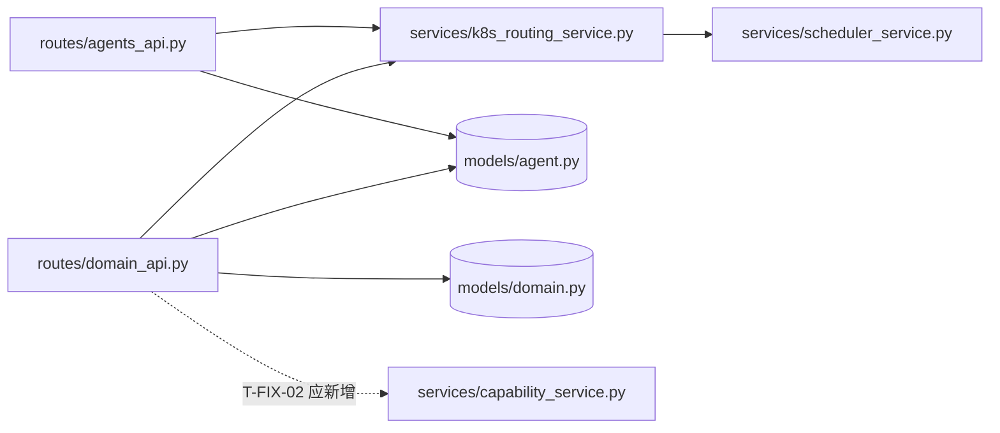

# REVIEW: capability-groups — 能力分组（Capability Groups）

- **Change ID**: capability-groups
- **审查时间**: 2026-09-23 09:08 CST
- **审查者**: AI（Reviewer 角色）· 4.2 二审于 v10 **已执行并回收**（fresh-context、只读；同模型 —— 环境无第二模型，待裁定第 4 条仍开放；详见 v10 第四节）
- **总体结论**: **阻塞（不通过）** —— 2.0 金字塔门禁 🔴（`TEST.md` 与 CHANGE.md 自declared 的 `test_backend.py` 均不存在）+ **8 项** 🔴 Critical（v1 为 7 项；本文件行头曾误记「5 项」，一并订正）。按 kit-6-review 步骤 2.0：**先回 5-test 补完**，Critical 未修或未获「已知接受」签字前禁止进 7-integration（R2.5）。**v10 注**：2.0 门禁已随 `T-FIX-00` 交付降为「部分轮次」常态（见 TEST.md 声明），R2.5 台账随进度更新（`T-FIX-04/13` 转绿有据），总口径不变。
- **版本**: **v10**（2026-09-24 09:4x 修订，见文末「v10」节）· 历史：**四版四票，每一版都被查出一处取证或判级错误**；v4 最重（F10 方向反了、照它修会造新 bug），v5 修的是**判据本身**（三条 verify 可在缺陷仍存活时为真 / 未修已为真）；v6 收领域专家改票 ✅ 带的 3 条文本级残留；**v7 收 Master 第二轮复核 ❌ 的 3 条（1 条活、2 条已在 v6 修）+ 更正我两次漏读票面 + 登记主审自己截断工件的操作失误**；v9 收「我自己造的假绿」（元规则 4b）；**v10 = 回流增补审查：T-FIX-13 代码首轮进审 + 4.2 二审首次回收 + 两条共享判据的计数重写（含否决 4-dev §6 推断与判死 v9 自己的「13F」假红判据）**

### 修订记录

| 版本 | 时间 | 触发 | 变更 |
|---|---|---|---|
| v1 | 09:08 | 6-review 主审 | 首版：15 项发现（7🔴/5🟡/3🟢），commit `97044bd0` |
| **v2** | 09:40 | **G4 安全审计师 ❌** | **F4 判错，已在四处改正**：① F4 原按「站点」记数（把 7 处同形查询当成一个可缓办的家族），改为**按 sink 分类**；② 新增 **F16 🔴 凭据搬运链**（`domain_api.py:208 → :231/:243 → chat_service.py:103`）—— v1 那句「capability 列表虽非密钥」恰好把最严重的一跳盖了过去；③ 补 **§2.4 安全审查节**（OWASP 逐项 + 身份层前提 + 依赖/秘钥扫描结果）与 3 条新盲区；④ 待人工裁定第 5 条按 sink 重述；⑤ `T-FIX-04` 拆出 `T-FIX-13`，两条 verify 改写为**不宣称「越权已修复」**，`T-FIX-00` 加「非 admin 身份 + 跨 owner 负例」硬要求 |
| **v3** | 09:5x | **G4 资深测试工程师（Master）❌ + 架构师 ✅带 6 条修订** | 两处**是我的取证/根因错误**，不是判断分歧：① **F6 根因写错** —— 我上一轮那条 `grep … \| head -60` 被截断，据此断言「`tokens.css` 无间距/圆角 scale」；全量重列实测 `:47` 有 `--s1..--s10`、`:50` 有 `--r-sm/--r-md/--r-lg`，且 `AgentControlPlane.tsx` 用它们 **0 次** → 正解是「**有 token 不用**」（机械替换），**不该拿它去换人工「已知接受」签字**；同因把 `--text` 这个已存在的中性前景也判成缺失。② **F3 计数 5 处错**（我的 verify grep 模式 `cfg.get("capabilities"` 漏了 `(x.model_config_json or {}).get(...)` 两处、以及「规范实现」自己文件内两处内联）→ 实为**后端 7 处 + 前端 2 处**。③ `T-FIX-00/01/02/04` 的 verify 与 write_files **互斥**（仓内**无任何 pytest 配置**，`pytest tests/` 收不到 `.specs/`）+ **全量基线实测 41 failed/134 passed/6 skipped** → 全部改定向。④ 2.3「反向依赖：无」**说过头**：我只 grep 了 `from routes`/`from main`，漏了 `services↔engine`。⑤ F13 在 2.2 记 🟡、汇总表记 🟢（自相矛盾，按取严）。⑥ 新增 **F17 🟡 归一化缺失**。⑦ T-FIX-01/02 争建同一文件（R7.3）→ 02 建、01 消费。⑧ 非二值 verify 全部改写。详见 TASK.md 修复任务段 v3 |
| **v4** | 10:1x | **G4 领域专家 ❌（第 4 票 → 4/4 收齐）** | **F10 取证方向反了 + `T-FIX-03` 是破坏性修复且其 verify 会假绿**（详见 F10 段更正声明）：真正恒假的是我打 ✅ 放过的 `:74-75`，被我判恒假的 `:156-1137` 反而是全文件唯一正确处。另按其实测补 **F18 前端第三套真相 / F19 默认域双指 / F20 `未分类` 占用命名空间**；**撤销 F15 的「范围蔓延」定性**，改记「路由/扩容缺需求溯源」（需求欠账，非实现越界）；F10 升 🔴；`'dead'` 告警永不触发、`AgentProbePanel.tsx` 5 处幽灵字段、`CONTEXT.md` 6 个术语零定义 → 进议题。四票齐，见末尾 G4 裁决 |
| **v5** | 10:4x | **G4 第二轮票：安全审计师 ✅（带 3 条新缺陷）+ 资深测试工程师（Master）复核 ❌（3 条 + 半条）** | 主审逐条实测后全部接受：① **`T-FIX-13` 的 verify 是坏判据** —— `encryption_service.py:20` 每次 `os.urandom(12)` 新 nonce，实跑 `encrypt(K) != encrypt(K)` 为 True → 「副本密文不等于受害者密文」可在**凭据仍被盗用**时变绿，改为**判明文**；② **F16 前置写小了** —— 不带 `X-User-Id` 即 admin、`_filter_owner` 对 admin 不加条件 → `:202` 与 `:208` **一起被旁路**，实跑 `scaled` 且 `decrypt(副本)==受害者明文` → 改记 **A01×A07**（反代后 = 远程未鉴权凭据窃取）；③ 身份层 fail-closed 由**前置改为结论**（用例今天就可写，这条 🔴 不该被顺序推走），「不带 admin 旁路」定为**默认**而非备选；④ **`T-FIX-03` 的计数归零形式作废**（今天 =4，含正确的 `:34`）；⑤ 三处 verify 打靶了 `write_files` 之外的文件（`_quick_test.py` + 两个前端测试文件）→ 补落点；⑥ 一条判据**未修就已为真**（`grep -c "<div onClick"` 今天 = 0，因 JSX 拆行）→ 换 `grep -A1 "<div$" \| grep -c onClick`（今天 6）；⑦ 全部 verify 标 **【验收】/【护栏】** 并附未修态实测值（TASK.md 新增基线表 14 行）；⑧ `:99` 与末尾汇总的两个权威计数**统一为 20 项**；⑨ 精化 `:411-413` → `:412-413`。**现行票数进入 2✅/2❌ 平票 → 按 R13.2 提交人工，见末尾「G4 第二轮」** |
| **v6** | 11:1x | **G4 领域专家改票 ❌ → ✅**（其 4 条通过条件在 v4 全部落地，逐条自跑复核；另附 3 条文本级残留 + 1 条计数残留） | 三条残留**确实活在 v5**，已修：① `T-FIX-03` 的 (b)「保持不动」与 (c)「各自具名」**字面冲突** → 改为「判定语义不得变：等值改名 `isProbeHealthy` 可以、换生命周期谓词 `isAgentHealthy` 不行」，并收下其精确取证（`=== 'healthy'` = **5** 处、`status === 'healthy'` = **4** 处，两个计数都不能当验收判据）；② (c) 要求改 DESIGN.md:97-104 但 DESIGN.md 只在 `read_files` → **那句话无处可写**，已补进 `write_files`；③ **F18 前端收敛两头各差一半**（`T-FIX-01/02` 要求前端归一却无前端落点；唯一能改这处逻辑的 `T-FIX-05` 只字未提归一）→ 写进 05 的 action 并加**能区分「搬家」与「归一」**的 vitest 断言（基线表 15 行）。**④ 计数残留与「`T-FIX-13` verify 仍判密文」两条是其读 tip `3c3a47bc`（v4）所见，已在 v5 `cdcc2425` 落地** —— 票面账面亦据其指正更正：安全审计师首轮 ❌ → 09:45 改票 ✅（三条已落地），见「G4 第三轮」 |

> **R9.2 二次确认记录**：F16 由安全审计师首指（给出逐行链），主审**未直接采信，而是独立复现后确认** —— §2.4 的 in-process 复现含「新副本 `api_key_encrypted` 与受害者密文逐字节相等」断言。F16 = 双角色确认的 🔴。
> **G4 提示**：v1 的投票基线已过时，**4 位投票人以 v2 为准**；若某票明确针对 v1，收票时按「对本文件投票」解释并在票面注明版本差异。

### 审查基线（工件与 diff 的实际情况，R6.2 明示）

| 项 | 状态 |
|---|---|
| `REQUIREMENT.md` | ✅ 在（54 行，FR1-FR5 / NFR1-NFR3） |
| `DESIGN.md` | ✅ 在（105 行，含「健康状态定义」节）—— 按 R2.7 已一并读 |
| `TASK.md` | ✅ 在（53 行 / **7 个 task 全为 `状态: [ ]` 未勾**） |
| `TEST.md` | ❌ **不存在**（CHANGE.md 变更范围第 5 行明确列为交付物） |
| `.specs/capability-groups/test_backend.py` | ❌ **不存在**（同上，CHANGE.md 列为交付物）；目录内只有 `_quick_test.py`（打印式脚本，无断言、需活服务端） |
| `UI-DESIGN.md` | ❌ 不存在（本 change 改了 `.tsx`，属前端项目 → 第三轮触发但无 UI 基线可比） |
| 「本次 diff」 | ⚠️ **无独立 diff 可取**。仓库以 `16117315 first commit` 整体导入，`d5a70feb` 仅为目录扁平化重命名（backend 全量 0→N 行）。故本轮以 **CHANGE.md「变更范围」表列出的 4 个文件面**为审查面，逐面核对代码事实。**此替代口径需人工确认（R18.1 ④）** |

> R2.7 全仓预检（同批扫描，供 STATE 使用）：本仓库当前**没有任何 change 具备进入 6-review 的完整前置**：
> `capability-groups`（缺 TEST.md）、`agent-domains`（缺 TEST.md、缺 REVIEW.md，代码已上线）、`small-model-decisions`（缺 DESIGN/TASK/TEST，无代码）、`knowledge-plus`（仅 TEST.md）、`multi-provider`（仅测试脚本）、`agent-control-plane`（已审并 4/4 通过，`.specs/agent-control-plane/REVIEW.md`）。选 `capability-groups` 作为本 issue 的审查目标：它是**工件最全且代码已实现**的一个。

---

## 第一轮 · Spec 合规审查

| 检查项 | 结果 | 证据 |
|---|---|---|
| FR1 Agent 按 capability 过滤 | ❌ **未忠实实现** | `backend/routes/agents_api.py:25,36-38` 用 `Agent.model_config_json.contains(f'"{capability}"')` → 编译为对整个 JSON 文本的 `LIKE '%…%'`。实测（SQLite 内存库，见「复现」）语义错误 |
| FR1 可与 `domain_id` 组合 | ✅ | 同函数 `:29-35`，`domain_id=0` → `IS NULL`（默认域）分支正确 |
| FR2 域内能力列表端点 | 🟡 实现，但**零消费者** | `backend/routes/domain_api.py:100-119` 存在且形状符合契约（额外多 `domain_name`，additive）；`frontend/src/stores/domains.ts` 全文无该端点的 fetch —— 前端在 `AgentControlPlane.tsx:585-605` 本地派生分组。用户故事 4「以便外部集成」因此**不可验证** |
| FR3 三层域树 | ✅ | `AgentControlPlane.tsx:585-605`（派生）+ `:660-698`（渲染 `CapabilityGroupRow`）+ `:708`（`expandedGroups: Set<string>`，key 格式符合 DESIGN §「展开状态」） |
| FR4 能力组展示（名称/数量/健康概要/箭头） | ✅ 实现符合 DESIGN | `:397`（`isAgentHealthy`）+ `:427-438`（📦 名、`{healthyCount} healthy / {totalCount} total`、`ChevronRight` 旋转箭头）。口径与 DESIGN.md:97-104「running/standby → healthy」**逐条一致** |
| FR5 未分类 / 默认域 | ✅ | `:594-596`（无 capabilities → `未分类`）、`:860-870`（默认域行，`isDefault`） |
| NFR1 零新增 TS 错误 | 🟡 不可完整验证 | 实跑 `tsc --noEmit -p tsconfig.json` → **32 个错误**，全部落在 `ProjectDetail.tsx`(15)、`__tests__/*`(12)、`ToolMarket.tsx`(2)、`WorkflowCreate.tsx`(1)、`ProjectManager.tsx`(1)、`AgentBuilder.tsx`(1)；`AgentControlPlane.tsx` 与 `stores/` **0 错误**。但项目构建契约本身是红的（pre-existing，见 STATE.md），无基线可 diff，「零**新增**」无法证明 |
| NFR2 向后兼容（现有端点/UI 不受影响） | ❌ **无证据** | 无 `TEST.md`、无 `test_backend.py`、`backend/tests/` 7 个文件**无一** grep 到 `capability`（实测）。回归完全未覆盖 |
| NFR3 虚拟分组 · 不建新表 | ✅ | `backend/models/` 无新增；`domain_api.py:110` 只读 `Agent` |
| 未引入 out-of-scope 内容 | ⚠️ 判不了 | `REQUIREMENT.md` **无 out-of-scope 段**（需求侧缺口，非实现问题）→ 记为 R18.4 议题 |
| 未范围蔓延 | ✅（v4 改判） | `CapabilityGroupRow` 承担自动路由/扩容/排队 badge（`:445-490`），FR4 只要求「组名、数量、健康概要、箭头」——但 v4 依领域专家证据**撤销越界定性**：路由/扩容规则本就是 capability 粒度且能力组行是唯一宿主，剥到域级反而失去可寻址处。真缺口是该业务规则**无需求溯源**（见 F15），属 R7「谁规定过」而非「按钮长在哪个组件里」，两件事已分开写 |
| 未越过 DESIGN 边界 | ❌ | DESIGN.md:54-66 明写后端实现应为「**`JSON_CONTAINS` 或 Python 端过滤**」，两种都**没用**，改用第三种（JSON 文本 LIKE）→ 设计偏离，且是唯一导致 FR1 错误的决定 |

**FR1 复现记录**（只读实验，未写盘；`cd backend && /home/malizhi/.venv/bin/python -c`，SQLAlchemy 2.0.54 + 内存 SQLite，3 条 Agent）：

```
编译出的谓词 : agents.model_config_json LIKE '%' || '"code-review"' || '%'
MySQL 方言   : agents.model_config_json LIKE concat('%%', '"code-review"', '%%')   ← JSON 列直接 LIKE，本项目 MySQL 为可选部署（CLAUDE.md），未实测 → 待确认

capability=code-review -> ['A','B']   期望 ['A']    ← B 的 capabilities 为空，"code-review" 出现在无关 key(note) 的值上 = 假阳性
capability=code_review -> ['A','B']   期望 []       ← 用户输入的 `_` 未被转义，成 SQL 单字符通配符
capability=%           -> ['A','B','C'] 期望 []     ← 通配符透传，过滤器可被完全绕过（返回含无能力 Agent）
```

> 说明：`contains()` 走的是**绑定参数**，`LIKE` 模式未转义只造成**语义绕过**而非 SQL 注入（`autoescape` 默认 False）。此点已核实，勿升级成注入告警。

**Spec 合规结论**：**不通过**。FR1 语义错误 + NFR2 零证据 + 偏离 DESIGN 指定实现方式。

---

## 第二轮 · 代码质量审查（6 维衰退风险）

### 2.0 TEST.md 5 轮金字塔完整性 —— 🔴 Critical（门禁）

| 轮次 | 状态 | 缺漏 |
|---|---|---|
| 1 功能 | ❌ | `TEST.md` 不存在；FR1-FR5 无一条有自动化测试；`backend/tests/` 0 命中 `capability`；`_quick_test.py` 为 print 脚本（无断言、依赖活服务、非常规测试入口，不进 pytest 收集） |
| 2 性能 | ❌ | 文件缺失，状态未声明（跳过的轮次也必须给理由，R5.4） |
| 3 安全 | ❌ | 同上 |
| 4 兼容 | ❌ | 同上（MySQL 可选部署的 JSON/LIKE 兼容性正是本轮该管的事，见 R2 发现） |
| 5 可观测 | ❌ | 同上 |

按 kit-6-review 步骤 2.0：**任意一项不达 → 🔴 Critical，先回 5-test 补完再继续后续审查**。本轮后续 2.1 的发现**照常报告**（已实测取证，压着不报等于丢信息），但**门禁结论不因它们而放松**：本 change 现在是「红」。

### 2.1 6 维诊断 · 严重度统计

| 编号 | 衰退风险 | 🔴 | 🟡 | 🟢 |
|---|---|---|---|---|
| R1 | Cognitive Overload 认知过载 | 0 | 1 | 0 |
| R2 | Change Propagation 变更传播 | 2 | 1 | 0 |
| R3 | Knowledge Duplication 知识重复 | 1 | 1 | 0 |
| R4 | Accidental Complexity 偶然复杂 | 0 | 1 | 0 |
| —（F17 · v3 归一化，跨 R3/R4） | | 0 | 1 | 0 |
| R5 | Dependency Disorder 依赖混乱 | 0 | 1 | 0 |
| R6 | Domain Model Distortion 领域扭曲 | 1 | 0 | 0 |
| —（UI · 第三轮另计） | | 3 | 1 | 1 |

> 本表按**诊断维度**计数（一次诊断可产出多条发现，且 Spec 合规轮的发现在此不重复计），**与「严重发现汇总」的 F 编号表不是同一分区**。> **权威计数只有一个：20 项 = 9 🔴 / 9 🟡 / 2 🟢**（v6 复确认：按能吃下 `| **F16** |` 加粗起头的解析逐行数过，与 F 表对得上；v5 统一：v2/v3 时期本节曾写「16 项 = 8🔴/5🟡/3🟢」而末尾汇总表写 17 项，两处都自称权威 → R2.5 的签字清单是按 🔴 数生成的，留两个数字会让人签错范围，Master 半条指出）。本节按**诊断维度**组织、与 F 编号表分区不同但项数可对齐，**计数一律以 F 表逐行数出为准**。⚠️ 数 F 表时注意 `| **F16** |` 那行以加粗起头，用 `^\| F` 会漏掉它（Master 自陈第一遍就漏过，与我上轮那个截断同源）。

### 2.2 6 维诊断 · 详细发现（4 要素）

### 🔴 R3 · Knowledge Duplication：新端点重写了同文件已 import 的既有 helper

**Symptom**：`backend/routes/domain_api.py:110-118` 手写「取 `model_config_json.capabilities` → 判 list → 过滤非 str/空白 → 去重」。`domain_api.py:9` **本来就 import 了** `_extract_capabilities` 并在 `:175`/`:211` 正常使用。同一决定在**后端 7 处**各表达一次（v3 订正：v2 记「5 处」是**我的 grep 模式漏了** —— `'cfg.get("capabilities"'` 匹配不到 `(x.model_config_json or {}).get(...)` 写法；换 `get("capabilities"` 实测为 `agents_api.py:133`、`agent_knowledge_api.py:714`、`domain_api.py:114`、`k8s_routing_service.py:26 / :39 / :108`、`gateway_api.py:85`）+ 前端 2 处（`AgentControlPlane.tsx:590`、`AgentBuilder.tsx:48`）。⚠️ 关键修正：被我称作「**规范实现**」的 `k8s_routing_service.py` **在自己文件内就有两处内联副本（`:39`、`:108`）而不调用自家的 `_extract_capabilities`** → 它只是「最不坏的一处」，**不是一个已存在的抽象**，别按「复用既有抽象」的轻松口径估工。`agents_api.py:37` 的语义还与其他 6 处不同（走 JSON 文本 LIKE）。
**Source**：Hunt & Thomas · *The Pragmatic Programmer* ·「Don't Repeat Yourself」；Fowler · *Refactoring* ·「Duplicated Code / Divergent Change」。项目侧对应 R6.4「沿用既有抽象」+ `CLAUDE.md` 约定「数据库访问统一走 …」。
**Consequence**：capability 的口径变更（例如将来允许 `{name, weight}` 对象形式，或加命名空间）需要同时改 5 处；漏一处即「路由认为有、UI 不显示、API 过滤不出来」三类静默不一致。已有一处（`agents_api.py:37`）**现在就**与其他不一致。
**Remedy**：
```python
# before (domain_api.py:110-118)
agents = db.query(Agent).filter(Agent.domain_id == domain_id).all()
caps_set = set()
for a in agents:
    cfg = a.model_config_json or {}
    caps = cfg.get("capabilities", [])
    if isinstance(caps, list):
        for c in caps:
            if isinstance(c, str) and c.strip():
                caps_set.add(c)

# after —— 复用本文件已 import 的规范 helper
agents = _owned_agents(db, user, domain_id)          # 见 T-FIX-04
caps_set = {c for a in agents for c in _extract_capabilities(a)}
```
并把 `_extract_capabilities` 提为 `services/` 公开函数（去下划线），前端对应逻辑收敛到 `stores/domains.ts` 一个 selector。
**生成 fix 任务**：T-FIX-02

### 🔴 R6 · Domain Model Distortion：「Agent 拥有某 capability」存在两套互相矛盾的真相

**Symptom**：API 层把 capability 当成「JSON 文本里出现了 `"x"` 这个带引号的子串」（`agents_api.py:36-38`）；UI 与路由层把它当成「`model_config_json.capabilities` 数组的成员」（`AgentControlPlane.tsx:585-605`、`k8s_routing_service.py:20-29`）。上表复现即为反例：Agent B 无 `code-review` 能力，**API 会返回它、画布不会分组它**。
**Source**：Evans · *Domain-Driven Design* ·「Ubiquitous Language / 模型与实现一致」；Fowler · *Refactoring* ·「Speculative Generality 的反面：模型失真」。
**Consequence**：外部集成方（用户故事 4 的目标读者）拿到的 Agent 集合与平台自己在画布上展示的集合不同 → 按 API 结果做扩缩容/路由决策会作用于错误的 Agent 组。这类 bug 在测试数据里通常不显形（需要恰好「别的 key 上出现同名值」），线上才炸。
**Remedy**：单一真相 = 数组成员判定。Python 端过滤（DESIGN.md:54-66 给的两个合法方案之一）：
```python
if capability:
    agents = _filter_owner(db.query(Agent), user).all()
    agents = [a for a in agents if capability in _extract_capabilities(a)]
```
数据量大再上 MySQL `JSON_CONTAINS` / SQLite `json_each`，并把「按哪个方言」写进 DESIGN 的兼容性约束里（R6.2：MySQL 路径本轮未实测，属待确认）。
**生成 fix 任务**：T-FIX-01

### 🔴 R2 · Change Propagation：一条「域内即全量」的查询被复制 7 份，**其中一份的 sink 是凭据**

**Symptom**：`domain_api.py:110` `db.query(Agent).filter(Agent.domain_id == domain_id).all()` **无 owner / 无 visibility 过滤**，是该文件第 **7** 处同形查询（实测 `:34, 91, 110, 143, 172, 208, 279`，本 change 新增 `:110`）。入口只做了 `_filter_owner(Domain)`（`:105-108`）—— 即代码在此把「域成员」当成了「可支配」。
**Source**：Fowler · *Refactoring* ·「Divergent Change / 同一不变量散落在多处」；Martin · *Clean Architecture* · 边界处强制策略。项目侧对应 `CLAUDE.md`：「同一不变量应在两处独立校验（入口 + 中间件）」+「`Domain` 不是安全边界」（**后者不能豁免本条**：恰恰是 `:202`/`:105` 把 Domain 当成了鉴权前提）。
**Consequence（v2 改正：必须按 sink 分，不能按站点分）**：同一句查询的 7 个调用点，**后果量级不同**，v1 把它们并成一谈是判级错误 ——

| sink 类型 | 调用点 | 后果 | 处置 |
|---|---|---|---|
| 返回 capability 字符串 | `:110`（本 change 新增） | 他人 Agent 的能力画像 + 存在性 | 🔴 本 change 内修（T-FIX-04） |
| **新建 Agent 行并复制凭据字段** | **`:208 → :231 → :243`** | **他人 LLM 凭据被搬运 + 他人 token 配额被消耗** | **🔴 独立成条 = F16，见 §2.4；不得缓办、不得只进 ROADMAP** |
| 计数 / 释放域绑定 / 排队统计 | `:34`(`agent_count`)、`:91`、`:143`、`:172`、`:279` | 存在性枚举 / 计数旁路 | 🔴→ 另开 CHANGE 统一收口（议题） |

另：`models/agent.py:33` `visibility` 默认 `"private"` 在**整个 backend 从未被用于任何查询条件**（全仓 grep：仅 `to_dict()` 输出 + `domain_api.py:248` 模板复制）→ 该字段目前是装饰性的，与产品承诺冲突。
**不变量矛盾（本次实测指出）**：`:202` 按「你是不是域 owner」鉴权、`:208` 按「域内即全量」取数、`agents_api.py:26` 又按 owner 过滤 —— **三处对「域 owner 对域内 Agent 有什么权」给了两个答案**。必须二选一并写进文档：要么「域成员＝管理权」（则删 owner 过滤并改产品口径），要么「域内每个 Agent 读写都按 owner 收口」（则 7 处全改）。现状是最坏的一种：两边都以为对方兜了底。
**Remedy**：按上表分档处理；统一收口函数 `_visible_agents(db, user, domain_id)`（admin 全量 / 非 admin 取 `owner_id == user["id"] or visibility != 'private'`）。**`visibility` 的落实与 6 处旧查询属跨端点修复 → 另开 CHANGE（R3.2/R7.1），但 `:208` 这条不在可另开的集合里（F16 与本条同文件同函数，见 §2.4）。**
**生成 fix 任务**：T-FIX-04（`:110`）· T-FIX-13（`:208` 链）· 其余 5 处 + `visibility` 落实 → 议题（R18.4）

### 🟡 R4 · Accidental Complexity：用字符串模式匹配冒充集合语义

**Symptom**：`agents_api.py:36-38` 三行里塞了「序列化 JSON → 手工补双引号 → LIKE → 通配符不转义」四层偶然复杂度；替代方案（`_extract_capabilities` + `in`）是**一行**且已在同仓存在。
**Source**·Bachman ·*Structure of Programming*／Ousterhout ·*A Philosophy of Software Design* ·「复杂度是功能乘出来的」；Ousterhout ·「Define Existence Out of Arguments」。
**Consequence**：后续维护者会加 `escape`、加 CAST、加分支兼容 MySQL —— 每一步都在给一个本不该存在的抽象打补丁。
**Remedy**：见 T-FIX-01；同时删除手写引号拼接。
**生成 fix 任务**：T-FIX-01

### 🟡 F17 · 归一化缺失：同一套真相自己裂开（v3 新增 · G4 架构师 ②，主审实跑确认）

**Symptom**：`_extract_capabilities` 只做「是 str 且 `strip()` 非空」的过滤，**从不改值本身** → 存成 `" code-review "` 的项原样保留。实跑 `sys.path=['backend']` 于 `['code-review',' code-review ','',7,None]` → `['code-review', ' code-review ']`，`set()` 得 **2 个不同元素**。
**Consequence**：部署数据里存在带空格值时，T-FIX-01 修完 `?capability=` 语义后，`distinct_capabilities()` **仍会把同一能力拆成两个画布分组**，而带空格那组**匹配不到任何查询**。即「UI 显示两组、API 只认一组」—— 这正是 F3 在 Consequence 里预言的那类静默不一致，**它现在就存在于被称作"规范实现"的那份代码里**。v1/v2 完全漏掉。
**Remedy**：归一化（`c.strip()`，是否折叠内部空白 / `casefold()` 由产品定但**必须写死在契约里**）放进**唯一的** `services/capability_service.py`；别在 7 处副本各 trim 一遍（那只是把重复搬家）。顺手要求已并入 T-FIX-02 的 `capabilities_of` 签名 + T-FIX-00 的反例（`['code-review',' code-review ']` 去重后须为 **1 组**）。
**判级说明**：🟡 不升 🔴 —— 它不阻塞本 change 出口，且修复是 T-FIX-02 建单一入口时的**顺手项**；升 🔴 会让"必须在 4 行签名里定死归一化语义"这个真实成本被低估。
**生成 fix 任务**：T-FIX-02（契约）+ T-FIX-00（反例）

### 🟡 R1 · Cognitive Overload：单文件 1428 行 / 单组件 176 行 / 14 个 props

**Symptom**：`frontend/src/pages/AgentControlPlane.tsx` = **1428 行**、一个文件内 ≥10 个组件；本次新增的 `CapabilityGroupRow`（`:370-540`）约 **171 行**、props **14 个**（`:371-386`），其中 `routeLoading`/`scaleLoading`/`autoRouteEnabled`/`queueCount` 与「能力分组」这一职责无关（同一组件既分组又承担路由/扩容操作面）。
**Source**：Martin · *Clean Architecture* ·「SRP 于模块」；Hunt & Thomas ·「Orthogonality」；Ousterhout ·「Class Tendency / 认知负载」。
**Consequence**：改分组展示要连带读懂排队/限流/loading 状态；本 change 的 UI 缺陷（见第三轮无障碍项）会扩散到不相关的控制面逻辑。
**Remedy**：把 `CapabilityGroupRow` 拆为 `CapabilityGroupHeader`（分组+健康概要）与 `GroupOpsBar`（路由/扩容/排队，props 打包成一个 `ops` 对象或下沉到 store 的选择器）；文件按组件切目录。
**生成 fix 任务**：T-FIX-05

### 🔴 F10（v4 重写）· 两套「状态」词表混用，恒假的不是我指的那两行 —— 是我的宾语搞错了

> **v4 更正声明（G4 领域专家 ❌②）**：v1–v3 这一段**取证方向反了**。我判定恒假的是 `:156-157`/`:1137`，理由是「`healthy` 从不是 `Agent.status` 的取值」—— 前提成立，**宾语错了**：那两处读的不是 `Agent.status`，是探针 DTO 的 `status`，`healthy` 恰在其取值域内 → 它们是**全文件唯一正确的健康判定**。真正恒假的是我当时**打了 ✅ 放过**的 `:74-75`。更要命的是我给的 remedy（改成 `isAgentHealthy(agent.status)`）会把现在正确的代码**改成恒假**，而它的 verify 恰好会被这次改坏所满足 → **假绿过关**。这不是措辞问题：报告是 4-dev 的输入，照它做会**造出一个新 bug**（R5.2 + R6.3）。以下为重写后的事实。

**词表（两侧都在同一文件里被混用）**

| 词表 | 取值域 | 写入点（实测） |
|---|---|---|
| **生命周期** `Agent.status` | `running` / `standby` / `paused` / `degraded` | `agents_api.py:125,167`、`reconcile_loop.py:419,439` |
| **探针判定** `AgentStatus.status` | `healthy` / `degraded` / `unhealthy` / `error` / `skipped` / `unknown` | `agent_probe_service.py:216,271,407,419`；`control_plane_api.py:94-95` 把它赋给 `entry["status"]` |

**逐行判决（全部实读原文 + 实读 payload 构造）**

| 行 | 代码 | 判决 | 依据 |
|---|---|---|---|
| `:108`/`:1033` | `agent: AgentStatus` | —— | prop 类型是**探针 DTO**，不是 `Agent`。v1–v3 我把它当 `Agent` 读，错从这里开始 |
| `:156-157`、`:1137` | `agent.status === 'healthy'` | ✅ **正确，勿动** | `status` 即探针判定，`healthy` 在其取值域内；且 `:160` 用 `getHealthLabel`（`:33-40`，正是探针词表）→ **自洽** |
| `:74` | `a.health === 'healthy'` → `healthyCount` | 🔴 **恒 `undefined` → 顶部「健康」卡永远显示 0** | `control_plane_api.py:75-85` 构造的 entry 键集里**没有 `health`**（实测该文件仅在 `:94-95` 写 `entry["status"]`，全文件无 `"health"` 键）；而卡片副标题还写着「healthy 状态」 |
| `:75` | `a.status === 'dead' \|\| a.health === 'unhealthy'` | 🔴 **两个分支都不可能为真 → 「异常」卡永远 0** | 探针词表里没有 `dead`；**全后端 grep `'dead'` 无任何写入点**，只有 `alert_service.py:141` 在**读**它 → 那条 `agent_dead` 告警同样**永不触发**（同一根因的第二处扩散） |
| `:531`、`:1076`、`:1129` | 渲染 `agent.runtime` | 🔴 恒空 | 同上，payload 无 `runtime` 键 |
| `stores/controlPlane.ts:8,10` | `health: string` / `runtime: string` | 🔴 **类型在撒谎** | 接口声明了两个后端从不发出的字段 → TS 编译期完全看不出问题，这正是它能活到今天的原因 |
| `AgentProbePanel.tsx:64,168,169,318,478` | 读 `probe.health` | 🟡 同根因既有扩散面（5 处，非本 change） | 契约修复时须一并 grep（R4.6） |
| `:112` + `:22-27` | `getStatusConfig(agent.status)` | 🔴 「运行状态」列**恒走 fallback** | `STATUS_CONFIG` 键集 `{running,idle,blocked,dead}` 作用在探针词表上**零交集** → 直接吐英文 `healthy`/`unhealthy` + muted 灰 |
| `:197-198` + `:15-20` | `STATUS_PRIORITY[a.status] ?? 99` | 🟡 列表排序**实际失效** | 优先级键集 `{dead:0,blocked:1,running:2,idle:3}` 同样零交集 → 全部落 99，排序退化为原序 |

**Source**：Evans · *DDD* ·「统一语言」；Ousterhout · *A Philosophy of Software Design* ·「深模块要求契约清晰」；项目侧 `CLAUDE.md`「路由只做参数校验与鉴权」的反面 —— 契约漂移没人守。
**Consequence**：这是**用户可见的错误数字**（两张概览卡恒 0 + 一列英文状态 + 排序失效），不是内部美感问题；本 change 的 DESIGN 首次把「健康」写成规范，使这些行成为**可判定**的错码。且 `未分类` 兜底桶与「默认域」双指（F19/F20）说明同一类「一个名字两个所指」在本模块是**系统性的**，不是孤例。
**Remedy**：见重写后的 `T-FIX-03`（四件事：补契约缺口 / `:156-1137` 不动 / 两词表各自具名 + DESIGN 加作用域声明 / verify 换成喂数据看行为）。**`:156-1137` 在报告里已明确标注「当前正确，勿动」**，供 4-dev 与后续 review 双向对账。
**v5 补一层（G4 资深测试工程师 ①，比我 v4 的措辞更硬）**：`grep -c "status === 'healthy'"` **今天实测 = 4** —— `:34`（`getHealthLabel` 内，全文件唯一与探针词表自洽的正确映射）+ `:156`/`:157`/`:1137`。action 只让改后三处 → 计数剩 1 → **任何「该计数归零」形式的 verify 都不可能通过，除非实现者再去改坏现在正确的 `getHealthLabel`**，或把字符串换成别的写法（两种都是造新 bug）。故 T-FIX-03 的 verify 已改成 `sed -n '74,75p' | grep -c "a\.health"`（今天 2 → 0）这种**只打真缺陷那一行**的形式，并明写「禁止用全文计数归零」。**判级变更**：🟡 → **🔴**（领域专家建议上调，主审按其实测后果同意：用户可见错误数字 + 技术上可行但业务上不通）。**R9.2 二次确认**：领域专家首指 → 主审逐行独立复现（含实读 payload 键构造与后端 `'dead'` 无写入点）后确认。
**生成 fix 任务**：T-FIX-03（重写）· 连带 `alert_service.py:141` 与 `AgentProbePanel.tsx` 5 处属既有扩散面 → 登记议题（T-FIX-12）

### 🟡 R5 · Dependency Disorder：业务逻辑落在 routes 层

**Symptom**：`domain_api.py:101-119`（集合派生 + 去重 + 排序）与 `agents_api.py:25-39`（过滤策略）写在路由里；`CLAUDE.md` 约定「路由只做参数校验与鉴权，业务逻辑放 `services/`」。方向上未出现反向/循环（见 2.3），属**层级渗漏**而非依赖混乱。
**Source**：Martin · *Clean Architecture* ·「Dependencies point inward」；项目自订约定（`CLAUDE.md` §约定）。
**Consequence**：capability 逻辑无法被非 HTTP 入口（定时任务、CLI、引擎）复用 —— 而 `scheduled_task` 已经有一条 `capability` 列（`agents_api.py:222-232`），下一步就会再抄第三份。
**Remedy**：新建 `services/capability_service.py`（`capabilities_of(agent)` / `filter_by_capability(agents, cap)` / `distinct_capabilities(agents)`），routes 只做校验与鉴权。与 T-FIX-02 合并执行。
**生成 fix 任务**：T-FIX-02

### 2.3 架构依赖图

2.2 触发条件逐项判：新增顶级模块/package ❌ · 危险 import 合并 ❌ · 新中间件/服务 ❌ · 跨 ≥5 模块重构 ❌ → **未触发**，只给本次面的最小方向核对（grep 实测）：



**循环依赖**：无（`grep "^from routes|from main import"` 在非 routes 层 0 命中；`main.py` 为组装根）。
**反向依赖**：**v3 订正 —— v2 写「无」说过头了**，我当时只 grep 了 `from routes` 与 `from main import`，**没查 `services → engine` 这条边**。架构师补测（我实跑复现）：

| 边 | 证据 | 性质 |
|---|---|---|
| `services/scheduler_service.py:5` → `engine/scheduler.py` | 顶层 import（非函数内延迟导入） | **服务层依赖调度策略层**。与 DESIGN.md:10 自己拍的「依赖只能向下」不冲突 —— 清单里根本没给 `engine` 排位次，所以"谁在谁上面"这个决定**没做完** |
| `engine/reconcile_loop.py:57`、`:464` → `services.agent_probe_service` / `services.audit_service` | **函数体内**延迟 import | 层级双向。刻意延迟规避 cycle 的写法（与 DESIGN.md:123-137 规避 `main` 循环 import 同法），**可辩护、不该报 🔴**，但必须记名：它使 `services↔engine` 在层级别双向，谁日后提模块、谁先 import 谁都会踩 |
| `engine/scheduler.py` | 仅 `heapq`/`dataclasses`/`time` | 叶子 —— 这正是「`PriorityQueue` 该下沉 shared/util 或不与调度策略同层」的实证理由（v2 给不出，因为我没跑过这条边） |

**准确表述**：routes→services→models 单向**成立**；**`services↔engine` 双向、无 import cycle**。故本轮**不为它出 🔴、也不阻塞本 change**，但 **F13 的 remedy 定调须一并写 `engine` 在依赖清单里的位置** —— 不补这一定义，「把域能力聚合逻辑下沉 `services/`」会立刻撞上「`services` 能不能 import `engine`」这个当前无人能答的问题（R6.2：该边未做全仓普查，只验了 capability 相关的这两个文件）。

### 2.4 安全审查节（v2 补 · G4 安全审计师 ❌ 的直接后果）

> kit-6-review 的三轮里没有独立安全节，但 2.0/2.1 把「安全」轮次推给 `TEST.md` —— 而本 change 的 `TEST.md` 不存在，所以**这条 🔴 与安全零证据同源**（同一条门禁红，不重复计两条）。本节按 G4 要求逐项标注 OWASP，**不适用的也写理由**。

#### F16 · 🔴 Critical（A01 越权 → **凭据搬运**）`POST /api/domains/{id}/scale`

主审独立复现（**in-process 直调端点函数**，内存 SQLite，未起 HTTP 服务）：

```
构造：Domain#1 owner=mallory（攻击者是域 owner）
      Agent#10 owner=alice,  domain_id=1, capabilities=["code-review"],
                api_key_encrypted="ENC::alice-super-secret-llm-key"     ← 受害者凭据
      Agent#11 owner=mallory, domain_id=1, capabilities=["python"]      ← 攻击者自己的 Agent（不含该 capability）
调用：scale_agents(domain_id=1, {"capability":"code-review","desired_replicas":2}, user=mallory)
结果：HTTP 返回 {'status': 'scaled'}
      新副本 id=12 name='alice-coder-replica-1' owner_id='mallory'
        api_key_encrypted == 受害者的密文 ? True          ← 逐字节相等
        model_config_json={'capabilities': ['code-review']}  visibility='private'
      攻击者 owner 过滤后能看到(即可 /run): [11, 12]      ← 副本归他所有，跑得动
      受害者 owner 过滤后能看到:            [10]
```

**链（每一跳都有行号，均已读过原文）**：

| 跳 | 位置 | 事实 |
|---|---|---|
| 1 | `domain_api.py:202` | 只鉴权「你是不是这个域的 owner」（`_filter_owner(Domain)`） |
| 2 | `domain_api.py:208` | `db.query(Agent).filter(Agent.domain_id == domain_id).all()` **不带 owner / 不带 visibility** →「域成员」被当成「可支配」 |
| 3 | `domain_api.py:212-215` | 按 capability 命中，`matching` 可包含**他人**的 Agent |
| 4 | `domain_api.py:231` | `template = matching[0]` → 模板可以是别人的 Agent |
| 5 | `domain_api.py:236,243` | `owner_id=user["id"]`（新副本归请求者）＋ **`api_key_encrypted=template.api_key_encrypted`**（装着别人的 LLM Key），`model_config_json`/`workflow_id`/`*_limit` 一并外移 |
| 6 | `agents_api.py` `api_run_agent` | 副本 `owner_id` 已是请求者 → **通过** `_filter_owner`，可正常执行 |
| 7 | `services/chat_service.py:103` | `api_key = decrypt(agent.api_key_encrypted)` → 执行时解密取用，**用的是受害者的 Key** |

**后果**：他人 LLM 凭据被盗用 + 他人 token 配额被消耗（`token_*_limit` 一并复制）+ 他人模型配置/工作流绑定外移。**不是**「证明其存在」——v1 就是这么轻描淡写的，判错。

**前置条件不是构造出来的**（这点决定严重度）：`agents_api.py:54`（创建）与 `:84-87`（`api_update_agent` 的 `setattr` 白名单含 `domain_id`）**接受任意 `domain_id`，既不校验存在也不校验归属** → 「团队域里装着非域 owner 的 Agent」是**当前代码的正常用法**，攻击者只需建一个域并等别人的 Agent 落进来（或反向：把自己的塞进别人的域再扩容，语义同样坏）。

**v5 更正 · 这条前置条件我写小了（G4 安全审计师 ②，主审 in-process 实跑确认）**：真实入口不是「当上域 owner」，是**「够得到这个端口」**。`main.py:209-210` 不带 `X-User-Id` 即 `get_user("admin")`，而 `_filter_owner` 见到 `role=="admin"` 就**完全不加条件** → **域检查（`:202`）与取数（`:208`）被一起旁路**。实跑对照（同一个 alice 拥有的域、mallory 不拥有它）：

```
非 admin 的 mallory（无域所有权）  -> HTTPException 404 域不存在        （:202 拦住了）
不带 X-User-Id 的默认身份 = admin  -> status=scaled，副本 owner_id=admin，
                                      decrypt(副本.api_key_encrypted) == 受害者明文 Key -> True
```

所以 F16 不是「A01 且攻击者恰好是域 owner」，是 **A01 × A07 的组合**：任何能到达端口的客户端默认就是 admin，可对**任意域内任意 Agent** 造出携带他人凭据的副本；而 `main.py:196-199` 的 localhost 判定**在反向代理后失效**（`CLAUDE.md` 已把这条记为待修）→ **真实部署下等价于远程未鉴权凭据窃取**。影响段按此口径读，别停在「域 owner 可 mint」。

**修复判据（T-FIX-13 的 verify · v5 改正：判明文，不判密文）**：非 Agent owner 的调用者，**无法 mint 出可被解密为他人明文 API Key 的副本**。⚠️ v3/v4 写的是「断言副本的 `api_key_encrypted` **不等于**受害者密文」—— **那是个坏判据**：`encryption_service.py:20` 每次 `nonce = os.urandom(12)` → 同一明文密文必然不同（实跑 `encrypt(K) != encrypt(K)` → **True**），于是 `api_key_encrypted = encrypt(decrypt(template.api_key_encrypted))` 这种**把受害者的 Key 重新加密挂到自己名下**的写法**逐字节不等、断言通过、盗窃完全成立**（`chat_service.py:103` 运行时照样解出明文取用）。上面 §2.4 的复现用的是 `"ENC::alice-…"` 假密文，它证明了复制传播，但**不能**当回归判据样板（R5.2）。

#### OWASP Top 10 逐项（本次审查面）

| # | 类别 | 判定 | 依据 |
|---|---|---|---|
| A01 | 失效的访问控制 | 🔴 **命中** | F16（`:208→:243`）+ `:110` 缺 owner 过滤 + `visibility` 全后端未执行 + 三处不变量互相矛盾 |
| A02 | 加密机制失效 | 🟡 不在本面，但相邻 | 口令为无盐 `hashlib.sha256`、默认口令 `123456` 硬编码（`CLAUDE.md` 已记为待修，属项目级议题）；**`api_key_encrypted` 走 `encryption_service` 是真加密** → F16 的可怕之处正在于"密文被合法搬走且运行时会解密" |
| A03 | 注入 | ✅ **不成立 —— 已由主审 v3 自跑负例（此前是二手采信安全审计师的结果，现已换成自己的一手证据）** | in-process 直调 `api_list_agents`，4 行数据、以非 admin 用户身份：<br>`capability="' OR '1'='1"` → `[]` 不报错；`capability="'; DROP TABLE agents; --"` → `[]` 且**表仍有 4 行** → 谓词走绑定参数，SQL 结构未被改写。<br>同一轮把 F2 的两个反例也钉死：`code-review` → `['a1','a2']`（**a2 的 `capabilities` 是 `[]`，只是另一个 key 的值恰为 `"code-review"`** → 跨 key 假阳性）、`code_review` → 同样 `['a1','a2']`（`_` 通配符把 `code-review` 也吃进来）。<br>**A01 维度亦不成立**：`%` → 只返回调用者自己的 3 条（他人的 a4 不出现）→ `:26` `_filter_owner` 确在 `:37` 之前生效。对照：**admin 身份 + `%` → 4 条全出**（含他人 Agent）→ 唯一逃逸口是角色，而角色来自 A07 的可伪造 header。<br>**结论**：F2 是**语义绕过 + 领域扭曲**，不挂安全名头；`capability=''` 实测返回全量（`if capability:` 跳过过滤）→ 该语义须在 TEST.md 里**显式择一**，不能靠巧合。 |
| A04 | 不安全设计 | 🟡 命中（设计层） | 「Domain 是分组还是权限边界」无人拍板（见 R2 节末不变量矛盾）→ 同类洞会在每个新端点复现 |
| A05 | 安全错误配置 | 🟡 项目级 | `main.py:196-199` localhost-only 判定在反向代理后失效（`request.client.host`）；`CLAUDE.md` 已记 |
| A06 | 易受攻击与过时组件 | ➖ **本 change 不适用** | 本次 commit 不含依赖变更（`git show --stat 97044bd0 ad350689` → 仅 3 个文档文件，0 个 `requirements` 行）。存量问题另计（见下「依赖扫描」） |
| A07 | 身份认证失效 | 🔴 **项目级命中，本面相邻 —— v5 升为 F16 的共同成因（A01×A07）**，admin 旁路会把 `:202` 域检查与 `:208` 取数**一起跳过** | `main.py:204` 从 `X-User-Id` 取身份、`:210` **不传即 `get_user("admin")`**；`auth.py:180-185` `get_current_user` 缺 state 时同样回退 admin，唯一缓解是 `main.py:196-199` 的 localhost 判定。**直接影响本轮所有行过滤修复的可验性**（见下方前提声明） |
| A08 | 软件与数据完整性失效 | ➖ 不适用 | 本面无反序列化、无插件/模板加载、无 CI 供应链变更 |
| A09 | 日志与监控失效 | 🟡 命中 | `log_audit` 确实记了 `domain.scale`（`:245+`），但**记不了"模板是别人的"**：审计字段无 `template_owner`。F16 发生时，审计日志看起来完全正常 |
| A10 | 服务端请求伪造 | ➖ 不适用 | 本面无出站 URL 取参（`control_plane_api` 的 `_resolve_health_url` 属别的 change，未审） |

#### 本轮新做的扫描（此前既没做也没列进盲区）

| 扫描 | 结果 | 口径 |
|---|---|---|
| 审查面秘钥/凭据模式 | **1 命中，判为非凭据**：`agents_api.py:45` `api_key = payload.get("api_key","") or "not_set"` 是缺失时的**占位默认值**，不是密钥字面量；4 个审查文件内无真实 key/token/AKIA 字面量 | 主审 grep 补做（`-Ei "(api_key\|secret\|token\|passw\|sk-\|AKIA)…[:=]…"`）。⚠️ 顺带一条 🟢：这行把「未提供 api_key」静默吞成 `"not_set"` 再 `encrypt()`，而不是 400 —— 与 F16 无涉，但会让"凭据缺失"在运行期才炸 |
| 依赖 CVE | **本轮未跑工具**（无 `pip-audit`/`safety` 可用；联网扫描不属本 run 交付）→ 记盲区 | 存量事实：`backend/requirements.txt` 13 条**全是 `>=` 区间、无任何锁文件**（`poetry.lock`/`uv.lock`/`requirements.lock` 均不存在）→ 构建不可复现，属项目级议题，**不是本门的红** |
| OWASP 逐项 | 已做（上表） | v1 全仓 grep `OWASP` 在本文件 0 命中 → 本轮补齐 |

#### 前提声明：本轮所有「行过滤」类修复都建在可伪造的身份上

`T-FIX-04` / `T-FIX-13` 的 owner/visibility 收口，前提是 `request.state.user` 可信 —— 而 A07 说明它**不可信**（无 `X-User-Id` 即 admin）。因此两条任务的 verify **一律不得写「越权已修复」**，只能写「**入口层已加行过滤，身份层仍待修**」（`CLAUDE.md`：同一不变量应在两处独立校验）。身份层 fail-open 不在本 change 面、已登记为项目级待修，**本处不另判一条红**，只防止它被当成已修。

---

## 第三轮 · UI 视觉审查（触发：本 change 改 `AgentControlPlane.tsx`）

> ⚠️ 覆盖盲区先说清：**无 `UI-DESIGN.md`** → 3.3「视觉北极星一致性」无法判定（不是"通过"，是"没基线"）。3.1 的颜色/token 判定按 `frontend/src/styles/tokens.css` 实际存在的变量执行。

### 3.1 Design Tokens 一致性

| 检查项 | 结果 | 证据（行号在本 change 组件内优先） |
|---|---|---|
| 颜色全部来自 token | ❌ | **硬编码纯白 `#fff`**：`:457`、`:473`（均在 `CapabilityGroupRow` 的操作按钮上）；另 `:850, :962, :1012, :1225`（pre-existing 同形）。**v3 订正**：我 v2 写「`tokens.css` 无中性白/前景 token」也不准 —— `--text: #e1e2e5`（`:34`）就是中性前景。正解是**改用 `var(--text)`**（禁纯白是 anti-pattern 要求，但不必新建 token，别为不存在的需求加变量） |
| 无硬编码 hex | ❌ | 同上（`#fff` ×6） |
| 无硬编码字号 | ❌ 命中即 🔴（kit 3.1 规则原文） | `:427` `fontSize: 10`、`:433` `fontSize: 10`、`:437` 同、`:405/:409` `fontSize: 10/11`、`:459/:475` `fontSize: 10` 等 —— 根因**只对一半**：全量列 `tokens.css` 61 个自定义属性后实测 **无任何 font-size token**（`--text/--text-secondary/--text-muted` 是**颜色**不是字号，`:34-36`），所以字号确实"物理上不可用"。**但 v2 同段把间距/圆角也说成缺失是错的**，见下一行 |
| 无硬编码间距/圆角 | ❌ 命中即 🔴 · **v3 根因订正** | `padding: '6px 8px'`(`:401,404`)、`'8px 12px'`(`:415`)、`'2px 8px'`、`'1px 6px'`(`:433,436`)、`borderRadius: 4/8`（`:402,441`）。**我 v2 的归因「`tokens.css` 只有 `--s1`/`--r-sm`，用 token 物理上不可用」是假的** —— 来源是我自己那条被 `head -60` 截断的 grep（同一份报告里另一行其实已写过「`--r-sm` 存在却未用」，v2 自相矛盾我没发现）。实测 `tokens.css:47` 有 `--s1/2/3/4/5/6/8/10`、`:50` 有 `--r-sm/--r-md/--r-lg`，tokens.css 自己用 `var(--s*)` 3 处，而 `AgentControlPlane.tsx` 用 `var(--s*)`/`var(--r-*)` **0 处** → 定性从「缺基础设施」改为「**有 token 不用**」：**机械替换、无需设计决策、不该拿去找人工签字** |
| 字体与 UI-DESIGN 一致 / 无 anti-pattern 字体 | ⚠️ 无法判（无 UI-DESIGN）+ **pre-existing 命中**：`tokens.css:43` `--font: -apple-system, BlinkMacSystemFont, 'Segoe UI', Roboto, sans-serif` 含 **Roboto**（强制禁忌 · 字体类）。非本 change 引入 | → 议题（R18.4），不入本 change |
| 第二个强调色 / 彩底灰字 / 纯黑纯白 | ❌ 纯白已记；`var(--purple)` 用于能力标签底色（`AgentBuilder.tsx:98`）属语义色，按「判断模糊地带」不判违规 | |

### 3.2 Anti-Pattern 扫描（逐条对照 `reference-ui-anti-patterns.md` 强制禁忌）

| 类别 | 命中 | 位置与说明 |
|---|---|---|
| 布局类 · **卡片嵌套卡片** | 🔴 **命中** | `AgentControlPlane.tsx:585-605` 的域容器是卡片（`border 1px + borderRadius: 8 + background: var(--bg-card)`），其展开区 `:660-698` 内每个 `CapabilityGroupRow` 又是一张卡片（`:402-403` `border + borderRadius: 4`），组内 Agent 行再套表格 → **三层树=三层卡片**，正是清单里「hierarchy flatten 优先」点名的形态 |
| 布局类 · 统一 4/8/12/16/20 间距 | 🔴 命中 | 同上间距值（4/6/8/12/16 族），与清单「用非线性 scale 替代」冲突 |
| 颜色类 · 纯白 `#fff` | 🔴 命中 | `:457, :473`（本 change）+ 4 处 pre-existing |
| 阴影类 | ✅ 未命中 | 本 change 面无 `box-shadow` |
| 边框类（彩色侧条 >1px / 玻璃拟态） | ✅ 未命中 | 仅 1px `var(--border)` |
| 动效类 | ✅ 未命中 | `transition: background .15s` / `transform: rotate` 只动 transform/背景，无 bounce；未动 layout 属性。（`prefers-reduced-motion` 见 3.4） |
| 文案类 | ✅ 未命中 | 无 hedging / lorem；按钮文案为具体动词「自动路由 / 扩容」 |
| 组件类（placeholder 当 label / 模态 ESC） | ➖ 本 change 面无表单与模态 | |

### 3.3 视觉北极星一致性

**未做** —— 缺 `UI-DESIGN.md`，无美学北极星可比。记为覆盖盲区，不记「通过」。

### 3.4 无障碍快检

| 检查项 | 结果 | 证据 |
|---|---|---|
| 交互元素键盘可达 | ❌ | 能力组头是 `<div`（`:412`）换行 `onClick={onToggle}`（`:413`）——**行号 v5 精化：`:411` 是外层卡片 div**；且该写法使字节串 `<div onClick` 在全文件 **0 命中**，非 `<button>`、无 `tabIndex` → Tab 不可达（WCAG 2.1.1 A 硬失败）。域级 `:552-556` 同形（pre-existing 模式），本 change 复制了它 |
| `aria-expanded` / 语义 | ❌ | 展开态只体现在 `transform: rotate(90deg)`（`:425`），读屏无 `aria-expanded`、无 `aria-controls` |
| 焦点环可见 | ⚠️ | 因不可聚焦，焦点环无从谈起；`tokens.css` 是否有 `:focus-visible` 样式未逐一验（**待确认**） |
| `prefers-reduced-motion` | ⚠️ 待确认 | 本 change 的 `transition` 有 `--fast`/`--ease` token 支撑；全局是否包了 reduced-motion 媒体查询未实测 |
| 对比度实测 | ❌ 未测 | 无浏览器/量具在本环境，`#fff` on `var(--blue)` 与 `fontSize: 10` 的 AA 达标**不可凭目测声明** → T-FIX-06 用工具实测 |
| 装饰图标 alt / aria-hidden | 🟢 | 图标为 lucide 组件 + emoji `📦`（`:430`）；emoji 兼作可见标签、又与图标库混用 → 视觉一致性小问题 |

**UI 轮结论**：🔴 ×3（纯白 `#fff`、硬编码字号 + 间距/圆角（**v3：字号确无 token；间距/圆角有 token 而不用**，两者性质不同、修法不同）、卡片嵌套）+ 🟡 ×1（键盘可达/ARIA）。全部生成 fix 任务。

---

## 第四轮 · 补充审查

### 4.1 技术债评估

**未触发**：本 change 非里程碑/季度大版本/重构项目；`.specs/CONTEXT.md` **无「技术债」段**（实测 grep 0 命中），不满足「多于 30 天未更新」的判定前提。
顺带登记事实（R18.4 议题，不入本 change）：`CONTEXT.md` 头部自述生成于 **2026-07-06**，至今 **79 天**，其 §3 代码规模表已与现实偏离（例：它记「后端 .py 112 / 前端 ts·tsx 96」，当前实测 **117 / 100**）。

### 4.2 跨模型 spot-check —— **触发已判定；二审结果本 turn 未回收 → 待确认**

触发依据（命中 2 条，均已实测）：① 本面涉及鉴权/越权（`domain_api.py:110` 无 owner 过滤，且 `visibility` 全后端未执行）；② `CapabilityGroupRow` ≈171 行 > 80 行。

**已做**：派出一个 **fresh-context 同模型二审 agent**（独立上下文、不带本报告任何结论，只给文件面与 spec 路径，允许其自行做只读复现实验）。

**未做，也不假装**：该二审在本 turn 结束前未返回（已就地取消，不留孤儿任务），其结果**不写进本报告**。故本节结论只有一条：

| 主审发现 | 二审发现 | 是否一致 | 处理 |
|---|---|---|---|
| F1-F15 | — | **待确认**（二审未回收） | G4 汇总轮补记，或按人工裁定改派真跨模型；G4 投票人须把本节当**已知盲区**看待 |

两条诚实边界（R6.2）：

1. **口径**：即便回收，本环境只有同模型可用 —— 那是「fresh-context 二审」，**不等同于** kit 4.2 要的跨模型。是否必须真跨模型 → 见「待人工裁定」第 4 条。
2. **本报告的可信度不依赖本节**。全部实质结论均由主审**自己实跑取证**：FR1 三个反例（内存 SQLite 复现）、谓词编译（SQLite + MySQL 方言）、`tsc --noEmit`（32 错误 / 本面 0 错误）、既有 helper 与 7 处引用点 grep、`visibility` 全后端 grep。二审是**加保险**，不是证据来源；它缺席不改变任何 🔴 判定，也不改变 2.0 门禁的红。

**待办**：G4 汇总轮（收齐 4 票后）补记本节；未补记前本 change 的 4.2 视为未闭环。

---

## 严重发现汇总

> **v4 合计 20 项：9 🔴 / 9 🟡 / 2 🟢**（v1 15/7🔴 → v2 +F16 → v3 +F17 且 F13 升 🟡 → v4 +F18/F19/F20 且 F10 升 🔴）。计数由本表逐行数出，非手填。

| # | 严重度 | 类别 | 描述 | 位置 | fix 任务 |
|---|---|---|---|---|---|
| F1 | 🔴 Critical | 测试门禁 | `TEST.md` 与 CHANGE.md 自declared 的 `test_backend.py` 均不存在，5 轮金字塔全部未声明；FR1-FR5 零自动化覆盖 | `.specs/capability-groups/` | T-FIX-00 |
| F2 | 🔴 Critical | Spec 合规 / R6 | 「Agent 有 capability」两套矛盾真相：API 用 JSON 文本 LIKE，UI/路由用数组成员；跨 key 假阳性 + `%`/`_` 通配符透传（实测复现）。**v9 补第 4 种形态：`LIKE` 对 ASCII 不区分大小写** —— `contains(f'"{capability}"')` 生成 `LIKE '%"code-review"%'`，**查询 `code-review` 会把能力写成 `Code-Review` 的 Agent 一起捞出**（主审内存 SQLite 实跑 `select 'ABC' like 'abc'`=1、反证 `glob`=0；MySQL 默认 `*_ci` collation 同形）。5-test 首报（`test_capab_query_does_not_fold_case`，今天红），属 **F2 的新表现形态，不单开 F 号**；`T-FIX-01` 的验收从「三种反例」改「**四种**」；换 Python 端成员判定后**一并消失**。⚠️ 与 O-9（折不折叠大小写）耦合：改判须前后端**同一批**改 | `backend/routes/agents_api.py:25,36-38`（`:37` 为第四形态实体） | T-FIX-01 |
| F3 | 🔴 Critical | R3 | 重写同文件已 import 的既有 helper（**v3：后端 7 处 + 前端 2 处**；「规范实现」自家文件内也有 2 处内联 → 不是现成抽象） | `backend/routes/domain_api.py:110-118` vs `services/k8s_routing_service.py:20-29` | T-FIX-02 |
| F4 | 🔴 Critical | 安全A01 / R2 | `:110` 无 owner/visibility 过滤的域内 Agent 查询（**v2 按 sink 降级重述**：本条 sink = capability 字符串；同族其余站点见 F16 与议题）；`visibility="private"` 全后端从未被执行 | `backend/routes/domain_api.py:110`（同形 `:34,91,143,172,279`） | T-FIX-04 |
| **F16** | 🔴 **Critical** | **安全A01 → 凭据搬运** | 域 owner 可用 `POST /api/domains/{id}/scale` 以**他人 Agent 为模板** mint 归自己所有的副本，**逐字节复制 `api_key_encrypted`**（`:208→:231→:243`），副本过 owner 过滤可运行 → `chat_service.py:103 decrypt()` 取用受害者凭据。in-process 复现见 §2.4。**v1 把它并进 F4 的「7 处同形查询」是判级错误** | `domain_api.py:202,208,231,236,243` + `chat_service.py:103` | **T-FIX-13** |
| F17 | 🟡 Major | R3/R4 | capability 值未归一化：带空格的 `" code-review "` 与 `"code-review"` 去重成 2 组、且前者匹配不到任何查询（v3 补 · 实跑确认） | `backend/services/k8s_routing_service.py:20-29` | T-FIX-02 + T-FIX-00 |
| F18 | 🟡 Major | R3 / R6 | **前端是 capability 的第三套真相**：`:588-592` 取 `cfg.capabilities` 后**不过滤**空串/空白/非字符串，而后端两套真相都会过滤 → `capabilities:[""]` 的 Agent 在画布上自成一个**空名分组**、在后端算「无能力」归入未分类。**`T-FIX-01` 只统一后端仍收不平**，且这正是 F3 抱怨的那类副本 | `AgentControlPlane.tsx:588-592`（已随 `T-FIX-05` 收口）vs `k8s_routing_service.py:20-29`；**v9 补第 4 套真相：`frontend/src/pages/AgentBuilder.tsx:48`** —— `(a.model_config_json && a.model_config_json.capabilities) \|\| []`，同样不过滤空串/空白（主审在 `50d944d5` 实跑 `grep -c` = 1 / `capabilitiesOf` = 0）。**「前端已平」这句话此前是错的**：`AgentControlPlane` 那处收口后只剩它，故新增 `T-FIX-14`（独立可做，不依赖 O-9/O-10） | T-FIX-01 + T-FIX-02 + **T-FIX-14** |
| F19 | 🟡 Major | R6 领域 | **「默认域」一词双指 → FR5 不可判定**：`main.py:143-151` 启动时**真建了一行** `Domain(name="默认域", owner_id="admin")`；而 `:860-870` 的「默认域」卡是 `domainKey="default"`/`domainId=null` 的 NULL 兜底桶，`:836` `sortedDomains` **不过滤**同名行 → 树上可**同时出现两张「默认域」**（一张可删、一张不可删）；删真实那行走 `domain_api.py:84`「`domain_id` 置 NULL（回归默认域）」= **把 Agent 从「默认域」搬进「默认域」**，删除计数对用户不可见。根因在 `agent-domains/REQUIREMENT.md` FR3 自相矛盾（既说"自动创建默认域行"又说"NULL 视为默认域"），本 change FR5 原样继承 | `main.py:143-151`、`AgentControlPlane.tsx:836,858-870`、`domain_api.py:84` | **待人工裁定第 6 条** + T-FIX-12 议题（R3.2：**禁止**混进 T-FIX-04 顺手改） |
| F20 | 🟡 Major | R6 领域 | `未分类` 是**裸字符串 key，与用户可自填的 capability 同一命名空间**（`:594-596` 与 `groups[cap]` 同表）→ 声明 capability 就叫 `未分类` 的 Agent 会并进兜底桶，并在 `domain_api.py:119` 的能力清单里与兜底桶**不可区分**。另 **FR1×FR5 的交集没有任何 AC**：`?capability=未分类` 在 T-FIX-01（数组成员判定）落地后**恒 0 条** → 外部集成方无法复现画布上那一组，用户故事 4 与 FR5 互相打不到 | `AgentControlPlane.tsx:594-596`、`domain_api.py:119` | **待人工裁定第 7 条**（兜底桶改保留字或 API 支持 `capability=__none__`，口径写进 FR5 → 属 1-requirement，Reviewer 只登记） |
| F5 | 🔴 Critical | UI 3.1/3.2 | 纯白 `#fff` 硬编码（本 change 按钮 2 处） | `AgentControlPlane.tsx:457,473`（另 `:850,962,1012,1225` pre-existing） | T-FIX-07 |
| F6 | 🔴 Critical | UI 3.1 | 硬编码字号 + 间距/圆角。**v3 拆性**：字号＝`tokens.css` 确无 font-size token（需人工定 scale）；间距/圆角＝**`--s*`/`--r-*` 已存在、本页面 0 引用**（机械替换，**不该进「已知接受」选项**） | `AgentControlPlane.tsx:401-441,459,475` | T-FIX-08 |
| F7 | 🔴 Critical | UI 3.2 | 卡片嵌套卡片（域卡片 > 能力组卡片 > Agent 行，三层树三层卡） | `AgentControlPlane.tsx:585-605` + `:402-403` | T-FIX-09 |
| F8 | 🟡 Major | Spec 合规 | 偏离 DESIGN 指定的实现方式（「`JSON_CONTAINS` 或 Python 端过滤」两者皆未用） | `DESIGN.md:54-66` vs `agents_api.py:36-38` | T-FIX-01 |
| F9 | 🟡 Major | UI 3.4 | 能力组头 `<div onClick>` 键盘不可达、无 `aria-expanded` | `AgentControlPlane.tsx:412-413,425` | T-FIX-06 |
| F10 | **🔴 Critical（v4 升级）** | R3 / 统一语言 | **两套状态词表混用，而我 v1–v3 指错了对象**：恒假的是 `:74/:75`（顶部「健康」与「异常」两张概览卡**永远 0**（实测卡片标签在 `:79-82`（`:79` 总数 / `:80` 健康 / `:81` 异常 / `:82` 队列任务；v7 我曾误记 `:79` 为异常卡，v8 按行实读订正）：`label: 健康 / sub: healthy 状态`、`label: 异常 / sub: dead / unhealthy`，两个 sub 里的取值都不可达） —— payload 无 `health` 键，且全后端无 `'dead'` 写入点，只有 `alert_service.py:141` 在读它 → 那条 `agent_dead` 告警同样永不触发）、`:531/:1076/:1129` 的 `runtime` 恒空、`getStatusConfig`(`:112`) 与 `STATUS_PRIORITY`(`:197`) 对探针词表**零交集** → 状态列吐英文、排序失效；`stores/controlPlane.ts:8,10` 声明了后端从不发的字段（**类型在撒谎**，所以编译期看不出来）。v1–v3 判为恒假的 `:156-1137` **是全文件唯一正确的健康判定** | `AgentControlPlane.tsx:74-75,156-157,531,1076,1129,1137` + `control_plane_api.py:75-85` + `stores/controlPlane.ts:8,10` | T-FIX-03（**v3 版会造新 bug，已重写**） |
| F11 | 🟡 Major | R1 | 1428 行单文件 / `CapabilityGroupRow` 171 行 14 props，分组与路由扩容同组件 | `AgentControlPlane.tsx:370-540` | T-FIX-05 |
| F12 | 🟡 Major | Spec 合规 | FR2 端点零消费者；用户故事 4「以便外部集成」不可验证 | `domain_api.py:100-119`、`stores/domains.ts`（无 fetch） | T-FIX-11 |
| F13 | **🟡 Major**（v3 取严）| R5 | 业务逻辑住 routes 层，违反 `CLAUDE.md`「路由只做参数校验与鉴权」——**v2 自相矛盾：2.2 正文记 🟡、本表记 🟢**，按取严统一为 🟡 | `domain_api.py:101-119`、`agents_api.py:25-39` | T-FIX-02 |
| F14 | 🟢 Minor | 一致性 | 组顺序两端各自 `sort()`，中文 `未分类` 的落位依赖 locale | `domain_api.py:119` / `AgentControlPlane.tsx:666` | T-FIX-10 |
| F15 | 🟢 Minor | 需求溯源（**v4 改定性**） | ~~范围蔓延~~ **撤销**：`route_to_agent`(`k8s_routing_service.py:50`) 与 `POST /domains/{id}/scale`(`domain_api.py:185-215`) **本来就是 capability 粒度**的既有规则，实测能力组行是这些按钮的**唯一宿主**（`DomainAccordionRow` 内无同形按钮，只透传 `onRoute/onScale`）→ 把按钮剥到域级会让「按能力扩容」失去可寻址处，**按业务语义能力组行是正确宿主**。真问题：这条业务规则在 `.specs/` 的 REQUIREMENT/DESIGN/CHANGE 里 **0 命中**（我实跑复核确认，只存在于 PRODUCT-DESIGN.html / COMPETITIVE-RESEARCH / BRAINSTORM）→ **需求欠账，不是实现越界** | `AgentControlPlane.tsx:445-490` | T-FIX-05 照做（R1 认知负载，与归属无关）· 溯源缺口 → 待人工裁定第 8 条 |

### 覆盖面声明（不把「没找到问题」当「没有问题」）

- **看了**：FR1-FR5 / NFR1-NFR3 逐条；`agents_api.py`（1-70 行）、`domain_api.py`（1-150 + 7 处 Agent 查询清单）、`k8s_routing_service.py`（1-60）、`models/agent.py` 全文、`AgentControlPlane.tsx` 的 `:74,156,360-490,552-700,860-870,1137`、`stores/domains.ts`、`tokens.css` token 清单、`backend/tests/` 全目录 grep、`.specs/capability-groups/` 四份工件。
- **实跑了**：`tsc --noEmit`（32 错误，本面 0）、SQLAlchemy 谓词编译（SQLite + MySQL 方言）、内存 SQLite 三条样本的 FR1 反例复现、`visibility` 与既有 helper 的全仓 grep。
- **没看 / 判不了（盲区）**：① 运行时 UAT —— 未启动 uvicorn/vite，任何"界面看起来对不对"都没验；② 对比度未实测（无量具）；③ MySQL 部署路径未实测 → 待确认；④ 无 `UI-DESIGN.md` → 视觉北极星与美学一致性整节跳过（非通过）；⑤ 无 `TEST.md` → 5 轮金字塔只能判缺，不能判过；⑥ 未审 `agent-domains`/`knowledge-plus`/`multi-provider`/`small-model-decisions`（均不满足预检）；⑦ 无独立 diff，按 CHANGE「变更范围」表界定审查面，可能漏掉未列在该表却被顺带改动的文件；⑧ 「未与 pre-existing 代码划清归属」的行已逐条标注，但 79 天未更新的 `CONTEXT.md` 使部分「是不是本次引入」只能靠 grep 推断。
- **v2 因安全节新增的盲区（别当通过）**：⑨ **依赖/CVE 扫描未跑工具**（环境无 `pip-audit`/`safety`，联网扫描不属本 run 交付）→ 仅登记存量事实：`requirements.txt` 13 条全 `>=` 区间、无锁文件；⑩ **F16 只做到 in-process 直调复现，未在跑起来的实例上打过 HTTP** → 跨进程/带真 `cryptography` 密钥的端到端链未验；⑪ **A07 身份伪造链的真实部署组合行为未实测** —— `X-User-Id` 伪造与 `main.py:196-199` localhost 判定在反向代理后的实际表现未验（未起服务），`CLAUDE.md` 已记此 fail-open；⑫ **OWASP 逐项是主审自标**：A03 已由主审自跑负例转一手证据（v3），A01 由安全审计师首指 + 主审 in-process 复现，**其余 7 项无第二人复核**；⑬ **F10 的界面表现未实测**（领域专家同一自白）：「健康卡恒 0」「状态列吐英文」是**静态契约推导 + payload 键实测**得出的，未起服务看渲染 → **UAT 时必须顺手确认顶部「健康」卡是否为 0**，若不为 0 则说明另有写入路径我没找到，F10 需再改。：A03 已由主审**自跑负例**转为一手证据（v3），A01 由安全审计师首指 + 主审 in-process 复现，其余 7 项**无第二人复核**。

---

## 待人工裁定（R2.5：🔴 必须修复或显式「已知接受」并签字）

| # | 需人拍板的取舍 | 依据 |
|---|---|---|
| 1 | F5/F6/F7 三项 UI 🔴 属全仓既有风格（`#fff` 另 4 处、三层树是产品形态本身）。选「本 change 内全修」还是「整体视觉规范化另开 change + 本 change 显式已知接受」？**v3 限定：F6 只有「字号」那一半可以进「已知接受」—— 间距/圆角的 token 早就有、本页面引用 0 次，属机械替换，拿它换签字是建立在假前提上（G4 测试 ④）**。另：`CHANGE.md` 交付物表把测试文件放在 `.specs/` 这个**路径本身是错的**（无 pytest 配置可收集它），签「审查口径」时须连带确认这一点 | 规则要求 🔴 不得被 AI 自行降级（R2.5） |
| 2 | 无独立 diff，是否接受以 CHANGE.md「变更范围」表作为审查面口径？ | R2.7 要求「本次 diff」 |
| 3 | `CapabilityGroupRow` 的路由/扩容按钮归属：本 change 剥离，还是承认为 control-plane 面（F15）？ | R7 范围控制 |
| 4 | 4.2 需不需要真·跨模型二审（本环境仅做到 fresh-context 同模型二审）？ | kit 4.2「强烈建议」 |
| 5 | **v2 已按 sink 重述，v1 的倾向作废。** 现拆成三档：`:110`（本 change 内修，T-FIX-04）✅ 无争议；`:208` 凭据链（F16/T-FIX-13）—— 安全审计师明确要求**不得缓办、不得只进 ROADMAP 议题**，主审独立复现后同意；但 `:208` 属**pre-existing 的 `/scale` 端点**、不在本 change「变更范围」内 → **唯一可处的两一个是「本 change 内修」还是「另开 CHANGE 优先修」，两个都不许"登记成议题以后再说"**（R2.5：🔴 不修就得人工签字「已知接受」，而凭据搬运这条主审不建议任何人签接受）。其余 5 处（`:34,91,143,172,279`）+ `visibility` 落实 + 三处不变量矛盾的方向选择 → 另开 CHANGE，同意。 | R2.5 / R3.2 / R7.1 |
| 6 | **F19「默认域」双指**：`agent-domains/REQUIREMENT.md` FR3 自相矛盾（既「自动创建默认域行」又「NULL 视为默认域」），本 change FR5 原样继承 → 须由 **1-requirement** 定口径（哪个才是「默认域」？兜底桶叫什么？删除语义与计数怎么显示）。Reviewer/Dev 均不得改需求（R3.2） | R3.2 / R6.5 |
| 7 | **F20 `未分类` 占用 capability 命名空间 + FR1×FR5 交集无 AC**：兜底桶改保留字（如 `__none__`）还是让 API 支持 `capability=未分类`？两者都要写进 FR5 才能派生 AC | R5.1 / R3.2 |
| 8 | **F15 需求欠账**：自动路由 / 弹性扩容这条业务规则在 `.specs/` 的 REQUIREMENT/DESIGN/CHANGE 中 **0 命中**（实测），只存在于 PRODUCT-DESIGN.html / COMPETITIVE-RESEARCH / BRAINSTORM。要不要补一条 REQUIREMENT 溯源（或明确它属 k8s 管控 change 的范围、本 change 只作宿主）？ | R7.1 / R3.2 |

---

## 修复任务（已追加至 `TASK.md`，编号延续）

见 `.specs/capability-groups/TASK.md` 末尾「## 修复任务（6-review 产出）」段：**T-FIX-00 ~ T-FIX-13**，每条含 `verify` 命令。T-FIX-00（补 5-test）为**回退任务**：完成前本 change 不得重进 6-review。
**v2 变更**：`T-FIX-04` 只管 `:110` 并把 verify 措辞改为「入口层已加行过滤，身份层仍待修」；新增 **`T-FIX-13`** 专办 F16 凭据链；`T-FIX-00` 增加「至少一条以**非 admin 身份**跑、断**跨 owner 负例**」硬要求，并禁止把 `_quick_test.py` 当回归基线。

---

## 自检

- [x] 三轮主审查都做了（一轮 Spec / 二轮 6 维 / 三轮 UI；本 change 涉 `.tsx` 故第三轮不可跳）
- [x] 二轮 6 维输出含 4 要素 + 书本引用 + R1~R6 编号
- [x] 第四轮按触发条件判完：4.1 未触发（已写明判据）· 4.2 触发已判定，**二审结果未回收 → 该节明示「待确认」，未冒充已跑**
- [x] 每条发现都有严重度标签 + `file:line` + 依据
- [x] 每个 Critical 都已生成 fix 任务（8 🔴 → F1:`T-FIX-00` F2:`01` F3:`02` F4:`04` F5:`07` F6:`08` F7:`09` F16:`13`）
- [x] 报告里没有自己悄悄改过的代码（R3.3 全程只读；实验均为 `python -` 内联 + 内存 SQLite，`log_audit` 打桩避免写 `backend/data/audit.jsonl`，未写盘、未入仓库）
- [x] **v2 新增**：安全审查节（§2.4）齐 —— F16 单列 🔴 + OWASP 逐项（不适用者给理由）+ 依赖/秘钥扫描结果 + 身份层前提声明
- [ ] **v3 自查失败模式（记给下一轮的自己）**：v1→v3 的**两处错同源** —— 我都把**被 `head -N` 截断的 grep 输出当成穷尽证据**（F6 的 token 清单、F3 的副本计数）。教训：**凡结论形如「X 不存在 / 共 N 处」，取证命令必须不截断且回显总数**（全量列 + `wc -l`）；做不到就把措辞降级成「至少 N 处」。
- [x] **v2 新增**：每个 🔴 的第二角色确认已记录（R9.2）—— F16 由安全审计师首指、主审独立复现确认；A03「不成立」由主审判、安全审计师跑负例背书。**其余 7 项 🔴 目前只有主审一人**，G4 其余三票须补这一层
- [x] **🛡️ G4 门禁（v8 · 第四轮）**：**4/4 全票 ✅，门结**（Master 于第三轮复核后撤回 ❌，其反对意见记录作废）（架构 ✅带 6 条 · 安全 ✅带 3 条 · 领域 ✅改票 · Master ❌三条新残留）。⚠️ 本行在 v4/v5 曾分别误记为 1/4 与 2✅2❌ 平票，两次都是**漏读已到票**（v7 更正，计数规程已进自查）。**通过的是「审查工件可交接」，不是「本 change 可集成」**（R2.5：9 项 🔴 一项未修）

---

## G4 裁决记录（4/4 票已收齐 · 2026-09-23 10:2x）

```
🗳️ G4 审查门: capability-groups REVIEW.md 是否完整、可验证？可否进入下一阶段？
   🟫 资深测试工程师（Master）: ❌ 附 4 条通过条件（T-FIX-00 落点/verify 互斥、测试口径抓不住 bug、
                                用例缺正向锚点与边界、F6 根因错）→ v3 已逐条实测并落地
   🟦 架构师:                 ✅ 附 6 条修订（重复面 8 处、归一化契约、01/02 抢建同一文件、
                                测试落点、pytest 基线红、services↔engine 反向边）→ v3 全部落地
   🟩 领域专家:               ❌ F10 取证方向反了 + T-FIX-03 会造新 bug 且 verify 假绿；
                                另补 F18/F19/F20 与 F15 改定性 → v4 已落地
   🔴 安全审计师:             ❌ 附 4 条通过条件（按 sink 分档、F16 独立成条、
                                T-FIX-00 非 admin + 跨 owner 负例、盲区补依赖/秘钥/OWASP）→ v2 已落地
   结果: 1/4 → 多数反对（3❌ / 1✅，且唯一 ✅ 明确声明"不等于放行合并"）
        → 按身份规约：列出全部反对理由，回本阶段（6-review）修改。**不推进、不进 7-integration。**
```

**四票的反对理由全部可核对**（逐条附实测：内存 SQLite 反例、AST 抽 payload 键、词表交叉 grep、`--collect-only`、定向跑全量测试）。三条 ❌ 均为「**加条件**」而非「加严」——门禁红（无 `TEST.md`）四方一致同意且独立成立。

**四票共同指向的一件事，比任何单条发现都重要**：本报告 v1→v4 的四处实质错误（F4 判级、F6 根因、F3 计数、F10 宾语）**没有一处是判断分歧，全是我的取证纪律问题** —— 截断的 grep 当成穷尽、二手结果当成本手、payload 键没实抽就读代码推断。审查者的可信度不来自结论严厉，来自每条证据可复跑。

**未闭环项（按 Master 硬要求显式记录，不因票齐而消解）**：4.2 跨模型二审**未执行**（fresh-context 二审派出于 turn 结束前取消），本节状态=待确认。放行进入下一阶段前须由人工决定是否补真跨模型二审（待裁定第 4 条）。

**⚠️ 本节是第一轮票（09:2x–09:4x）的记录，结论已被下方「G4 第二轮」更新 —— 读结论请读最后一节。**

**v4 轮已落地的修订**：REVIEW.md v4（20 项 / 9🔴）· TASK.md T-FIX-00~13 全段重写为可交接（含 T-FIX-03 重写）。**下一步不是推进，而是：三位 ❌ 投票人按各自给的核对命令复核 v4 → 改票；同时待人工裁定 8 条需人拍板（其中第 1/2/6/7/8 条涉及需求与签字，AI 无权自决）。**

**下一步**：① 等 🔴 领域专家票 + 两位 ❌ 的复核改票（v3 已把核对命令原样交回）；② 门结后无论 3/4 还是 4/4，第一个动作都是**回 5-test 跑 T-FIX-00**，不是进 7-integration；③ **4.2 跨模型二审未闭环，必须在 G4 最终结论里点名**（G4 测试工程师硬要求：不许因「票收齐」就自动当它结了）。**当前不得进集成、不得合并。**

---

## G4 第二轮（2026-09-23 10:5x · 票面更新）

```
🗳️ G4 审查门（第二轮）: REVIEW.md v5 + T-FIX 段是否完整、可验证、可交接？
   🟫 资深测试工程师（Master）: ❌ 4 条已认下（逐条实测），另开 3 条 + 半条：T-FIX-03 计数归零只能靠改坏
                                 正确代码通过 / 三处 verify 打靶 write_files 之外的文件 /
                                 一条判据未修已为真 + verify 未标【验收】【护栏】/ 两个权威计数打架
   🟦 架构师:                 ✅（其 6 条已在 v3 落地；明确「读成可合并即误读」）
   🟩 领域专家:               ❌（其 F10/T-FIX-03 与 F18-F20 已在 v4 落地，尚未回来复核改票）
   🔴 安全审计师:             ✅ v3 安全节 4 条全认，另带 3 条新缺陷（①坏判据 ②F16 前置写小 ③顺序改结论）
                              —— 三条已在 v5 全部落地
   结果: 2✅ / 2❌ → 平票 → 按 R13.2/身份规约：列出分歧点提交人工，本阶段停止推进。
```

**分歧点其实只有一个半**（这点要说清，免得人工看到 2/2 就以为存在判断冲突）：
1. **实质上无人分歧**：四位都同意 ①本 change 阻塞 ②门禁红独立成立（缺 `TEST.md`，出口是先回 5-test）③`T-FIX-03` v3 版会造成新 bug。
2. **唯一分歧是「工件现在是否已可交接」**：Master 与安全审计师的 ❌/带条件 ✅ 都指向**本轮 v5 刚落地**的内容，他们**尚未复核 v5**；领域专家的 ❌ 同理指向 v4。也就是：票面上是 2/2，实际上是「三人待复核」。
3. **半个真分歧（须人拍板，我不该自决）**：`T-FIX-13` 的「admin 旁路要不要保留」。安全审计师主张**默认为不带 admin 旁路**（域 owner 与 admin 都没有正当理由 mint 别人凭据的副本）；这与 `CLAUDE.md`「`Domain` 不是安全边界」的既有口径存在张力 —— 但注意该口径说的是**逻辑分组不隔离执行**，不能反推「谁都能搬别人的 API Key」。**我的建议：采纳安全口径（收口不带 admin 旁路），但这是偏好类决策（R18 ①④）→ 交人工签**。

**按 Master 要求把裁决写成两行，不许读成一句**：
- ① **门禁红独立成立**（缺 `TEST.md`/`test_backend.py`，F1）→ 唯一出口是先回 **5-test** 跑 `T-FIX-00`，不是进 7-integration。
- ② **修复工件此刻仍不可交接**（第二轮 3 条 + 半条）→ `TASK.md` 的 T-FIX 段还要再过一轮复核；**「改完 T-FIX 就能合并」这个读法是错的**（架构师 ✅ 的原话也不是这个意思）。

**R9.2 二次确认现状**：F16 二人（安全首指 + 主审复现）、F2 二人（Master 独立跑 SQLite 反例 + 主审）、F10 反转二人（领域首指 + 主审逐行复现）+ **Master 对 F10/T-FIX-03 的第三方复核**、T-FIX-03 坏判据二人（安全 + 主审实跑 nonce）。

**4.2 跨模型二审：仍未执行**（状态=待确认，见上），票齐与平票都不使它结。→ 待人工裁定第 4 条。

**待人工裁定 8 条 + 本轮新增 1 条偏好决策（admin 旁路口径）**：见上表，全部属 R18 ①④，AI 不得自决。

> **⚠️ 这 9 条里只有第 9 条会改变代码形状**（`T-FIX-13` 保留/不保留 admin 旁路 = 是否要在域内复制路径上再插一层身份校验，影响 `domain_api.py` 与 `control_plane_api` 两条入口的实现），其余 8 条是**口径/归属/测试路径**类裁定，不阻塞 4-dev 动手。G4 · Master 第三轮提醒（10:13）：别让第 9 条被前 8 条的注意力吃掉 —— 安全审计师与本主审均倾向**默认不保留旁路**，`T-FIX-13` 已按该默认写，人工若选保留，只需改判据不必修代码方向。


---

## G4 第三轮（2026-09-23 11:2x · 门通过 3/4）

```
🗳️ G4 审查门（第三轮）: REVIEW.md v6 + T-FIX 段是否完整、可验证、可交接？
   🟫 资深测试工程师（Master）: ❌（其 4 条已在 v3/v5 落地、半条计数残留已统一；v5/v6 的落地尚未经其
                                 复核 → 票面仍是 ❌，不是判断冲突）
   🟦 架构师:                 ✅（6 条已落地；原话「读成可合并即误读」）
   🟩 领域专家:               ✅ 改票（其 4 条逐条自跑复核通过；3 条残留已在 v6 修掉）
                              —— 并主动指出主审票面账面两处不一致，逼出本节更正记录
| **v7** | 10:1x | **G4 资深测试工程师（Master）第二轮复核 ❌（3 条新残留）+ 票面更正指令** | 核实：① **活在 v6、最实的一条** —— `T-FIX-02` verify ① 作用域含 `backend/tests/`，而 `T-FIX-00` 硬要写的 FR2 契约断言必然引入 `data.get("capabilities")` → **判据被自己人钉死在 ≥1、永不通过**（假红 → 诱导删断言 R5.3 / 越界改测试 R7.3）→ 已收窄到 `routes/ services/`，并把「7→1」与「7→0」两口径之差（helper 内部那 1 处）写明；② 元规则 1 由「verify 靶文件」扩到「**action 要求改的文件也要有落点**」（本轮两次都栽在这一面）；③ `T-FIX-03` 三条行为断言**没有 runner、`write_files` 无测试文件** → 补 `agent-health-contract.test.tsx` + 点名 `npx vitest run`，主审**实跑证明 runner 可用**（`vite.config.ts:7` jsdom、`@testing-library/react ^16`、`npx vitest run src/__tests__/chat-store.test.ts` → `7 passed`），并写可测性前置（给 `OverviewCards`/`AgentRow` 加 `export`，不改语义）**或**显式降级为 UAT 人工步骤 —— 不留无落点的「造一条…断言…」句子；④ 判据④ 误标【护栏】→ 改【验收】；⑤ 其 ②（F18 前端落点）与 ③ 前半（DESIGN 落点）**已在 v6 修**，其读的是 v5 tip；⑥ **票面第二次漏读已认**：09:58 我写「2✅/2❌ 平票」，而领域专家 **09:56:38 已改投 ✅** → 当时真值 3✅/1❌；09:49 那轮同样把安全记成 ❌（其 09:45 已 ✅）→ 规程进自查；⑦ 登记主审操作失误：自指写把 `TASK.md` 截成 0 字节，已复原并 sha256 校验一致 |
| **v9** | 11:2x | **下游三轮交付回流**：5-test `T-FIX-00` 第 1/2 轮（`5092f1de`→`0726c73b`，26→**28 条**）· 4-dev `T-FIX-05`（`0f10be77`）+ `T-FIX-04`（`50d944d5`）· 第三方 verify 执行复跑（五条全中） | ① **主审自己制造的假绿被抓出并修掉**（最高优先）：`T-FIX-03` 判据⑤ 用 `sed -n '74,75p'` 行区间，`T-FIX-05` 之后区间打到 `function OverviewCards…` → **打印 0、判据"看起来已满足"，而 `a.health` 实际住在 `:76-77`**；主审在 `50d944d5` 一手复现（区间版 0 / 全文版 2）→ 判据改**全文件内容锚**，并立**元规则 4b**（判据优先内容锚；行号锚点跨任务会漂，卡片 `:79-82`→`:81-84`、`status==='healthy'` 4 处但行号全变、`:1137→:1081`）。② **F2 补第 4 种表现形态**（大小写，见 F2 行）。③ **F18 补第 4 套真相** `AgentBuilder.tsx:48`（见 F18 行 + 新增 `T-FIX-14`）。④ **元规则 2 升格**：跨任务共享判据一律「类型 + 未修态取值 + **取值来源 tip**」三件套（`T-FIX-00` verify ② 的「定向通过」措辞已被 4-dev 第二次撞到 → 改为可判定计数式）。⑤ **元规则 4c**：`STATE.md` 列为元规则 1 的显式例外（O-8，两处同证）。⑥ **`T-FIX-06` 元规则 1 复现 + 辅判假红**（action 目标已搬进 `CapabilityGroupHeader.tsx:33-35` 而该文件不在 `write_files`；页面同名计数 5 处不属本任务）→ 补落点 + 按文件拆分。⑦ **O-9/O-10/O-11 并入待人工裁定并首次 @ 人**（此前九条只写在工件里，从未真正送达人工）。 |
| **v8** | 10:3x | **G4 资深测试工程师（Master）第三轮复核 ✅ → 4/4 全票通过，门结** | Master 逐字复跑三条确认落地并**撤回其 ❌、反对意见记录作废**；其「顺带核到」一条亦成立（v5→v7 的 `T-FIX-00` 段 diff 未变 → 其对 `T-FIX-00` 的复核继续有效）。v8 只吸收其 3 条**前看提醒**（明说「不计为条件、不必再改工件」，主审仍落成规则以免下轮重犯）：① 新增**元规则 3**（`vitest run <pattern>` 按文件名子串过滤 → 改名即假红 / 静默 0 用例即假绿，须同时断言用例数 ≥1）；② 新增**元规则 4**（`AgentControlPlane.tsx` 是 03/05/06/07/08/09 **六条**的靶文件 → 必须串行/单写者，否则 R6.5 边界判据互判越界）；③ 卡片行号订正 `:79` → **`:81`**（实读 `:79` 总数 / `:80` 健康 / `:81` 异常 / `:82` 队列任务），并把「我 v7 误记 `:79`」一并记进 F10 行 |
   🔴 安全审计师:             ✅（首轮 ❌@09:2x → 09:45 改票 ✅ 带 3 条，三条已在 v5 落地）
   结果: 3/4 → ✅ 门通过；反对意见按规约记在本工件内（= 上方「G4 第二轮」里 Master 的 3 条 + 半条，
          其 v5/v6 落地状态待其复核）。v6 三条残留与那批合并为同一轮 TASK.md 修订，未分两批。
```

**门通过 ≠ 可以集成。** 下面四条同时成立，不许被「3/4」这个数字掩盖：

1. **R2.5 仍拦在集成前面**：9 项 🔴 **一项未修**（本轮起只改审查工件，按 R3.3 不动代码）→ 未取得人工「已知接受」签字前**禁止进 7-integration、禁止合并**。架构师与领域专家的 ✅ 各自都写了这条声明。
2. **2.0 门禁红独立成立**：`TEST.md` / `test_backend.py` 不存在 → 唯一出口是先回 **5-test** 执行 `T-FIX-00`（RED 先行、真实 session、禁 mock、禁打活服务、贴全量基线输出）。
3. **4.2 跨模型二审仍未执行**（状态 = 待确认），不因三轮票齐而结。
4. **待人工裁定 9 条**（8 条原表 + admin 旁路口径）仍挂人工；注意只有「想跳过某个 🔴」才必须先签，**动手修它不需要等签字**。

**R9.2 交叉确认现状**（均为独立复跑，非二手）：F10 反转 = 领域专家首指 + 主审逐行复现 + Master 第三方复核（给出更硬的 `:34` 一层）+ 领域专家第四人复核 v4 修复；F16 凭据链 = 安全首指 + 主审 in-process；`T-FIX-13` 坏判据 = 安全 + 主审实跑 nonce；F2 两套真相 = Master 独立 SQLite 反例 + 主审 + 领域专家 AST 复现。

**下一步（本轮已派）**：`T-FIX-00` → 5-test 主责。`T-FIX-03` 的三道残留已在 v6 清掉，其「残留修掉前不得进 4-dev」的条件视为已满足，最终以 Master 复核为口径。

---

## 主审自查补丁（v7 · 两条用代价换来的规程）

**① 票面计数规程（两次漏读换来）**：出任何「🗳️ 结果: N/4」块之前，必须跑一次
`multica issue comment list <id> --since <上一轮锚点> --compact --output json`，**按 author 分组、每人取时间最晚的那条 🗳️ 评论**作为其现行票，然后再写块。
禁止凭记忆、凭「上一轮我以为的状态」写票数。本轮两次同形错误（09:49 记安全为 ❌、09:58 记平票）都是**在复述状态而不是数状态**；第二次尤其贵 —— 它让裁决块把「提交人工裁平票」当成动作，而真实动作是「多数通过 → 回 5-test，人工只签 R2.5」。

**② 工件写入纪律（一次截断事故换来）**：本轮我用一句自指的
`open(p,'w').write(open(p).read())` 把 `TASK.md` 写成 **0 字节**（`'w'` 先截断，内层 `read()` 才执行）。已从 HEAD `git checkout` 复原并 **sha256 逐字节校验一致**（225 行 / 14 个 T-FIX 小节），同批复原了被 `vitest` 改动的 `frontend/node_modules/.vite/vitest/results.json`（本仓 `node_modules` 被跟踪，跑测试必脏 `git status`，`CLAUDE.md` 早有记述 —— 是我没预判）。
规则：**改工件一律「读进内存 → 全部算完 → 只 `write` 一次」**，写入前加长度下界守卫（`assert len(new) > len(old) * 0.9`），禁止任何 read-modify-write 自指形式。发现方式也记下来：不是我检查出来的，是**紧接着的编辑找不到锚点**才暴露的 —— 所以「编辑后立刻 `wc -l` / `git diff --stat` 回看」应是固定动作，而不是等下一次失败。


---

## G4 第四轮（2026-09-23 10:4x · **4/4 全票通过，门结**）

```
🗳️ G4 审查门（第四轮 · 终局）: capability-groups 的 REVIEW.md + T-FIX 段是否完整、可验证、可交接？
   🟫 资深测试工程师（Master）: ✅ 第三轮复核，三条逐字复跑确认落地 → 撤回 ❌，反对意见记录作废
   🟦 架构师:                 ✅ 其 6 条已在 v3 落地（原话：读成可合并即误读）
   🟩 领域专家:               ✅ 其 4 条已在 v4 落地（09:56 改票）
   🔴 安全审计师:             ✅ 其 4 条已在 v2 落地、新 3 条已在 v5 落地（09:45 改票）
   结果: 4/4 → ✅ 按 R13.2/R9.3 自动进入下一阶段，禁止再问「要继续吗」。
```

**全票通过的是「审查工件可作为下游输入」，不是本 change 可集成。** 四件事同时成立，按 R13.2 逐条点名，不许被「4/4」掩盖：

1. **唯一合法出口 = 回 5-test，第一动作是 `T-FIX-05` 再 `T-FIX-00`**（顺序已写死在任务里：05 与 00 之前/同波）。集成侧被 **R2.5** 拦住：**9 项 🔴 一项未修**（6-review 全程按 R3.3 只改工件，未动一行代码）。
2. **人工欠项 = R2.5 那 9 条签字 + R15.2 合并确认**，不是「裁 G4 平票」。修 🔴 不需要等签，**只有想跳过某个 🔴 才需要先签** → 5-test/4-dev 现在就能开工。其中**第 9 条（`T-FIX-13` 是否保留 admin 旁路）是唯一会改变代码形状的一条**，别被前 8 条吃掉注意力。
3. **4.2 跨模型二审 = 未执行**（状态 = 待确认）。票齐不使它结，也不因票齐而消失。
4. **两个数至今只有一个来源**：全量 `41 failed / 134 passed / 6 skipped` 只有主审一次实跑（Master 只跑 `--collect-only` 得 181 与之自洽；`tsc = 32` 有 `CLAUDE.md` 作第二来源）。契约已写对（TEST.md 第 1 轮**第一行**贴全量真实输出）→ **5-test 交付时必须当第一行，不当附录**。

**R9.2 全票终局**：F16 = 安全首指 + 主审 in-process；F10 反转 = 领域首指 + Master 复核（更硬的 `:34` 一层）+ 主审逐行 + 领域第四人复核；F2 = Master 独立 SQLite 反例 + 主审 + 领域 AST 复现；`T-FIX-13` 坏判据 = 安全 + 主审实跑 nonce。**四个 🔴 家族全部二人以上独立复跑。**

**四轮里主审被票友查实并改正的实质错误共 6 处**（无一属判断分歧，全为取证/口径纪律）：F4 判级按站点计 · F6 根因（截断 grep）· F3 计数（截断 + 模式漏）· F10 宾语指错 · `T-FIX-13`/`T-FIX-03`/`T-FIX-06`/`T-FIX-02` 四条判据分别在缺陷存活时可为真、未修已为真、无 runner、或作用域含 tests → 假绿/假红 · **票面两次漏读已到票**。四条元规则（本段头）与两条自查规程（文末「主审自查补丁」）即其沉淀。

---

## 待人工裁定账本 v9（新增 O-9 / O-10 / O-11 · **本轮首次真正送达人工**）

原 9 条不变；这三条由下游三轮交付具体化而来。**只有想跳过某个 🔴 才需要签字**，所以 `T-FIX-13`/`T-FIX-14` 现在就能做（见末尾派单），但**队列头 `T-FIX-02` 卡在 O-10 上**，不答就只有两条 🔴 在原地。

| 编号 | 议题 | 选项与代价（**由 4-dev 实测过边界影响**） | 谁倾向什么 | 不答的后果 |
|---|---|---|---|---|
| **O-10**（= R4.6 人批，新） | `T-FIX-02` 要改 `_extract_capabilities`（`k8s_routing_service.py:20`，11 行体，被 `domain_api.py:9` 跨模块 import，调用点 `:175/:211/:285`）→ 同时命中「删既有代码 ≥5 行」与「删/重命名导出符号」，R4.6 要求人批 | **(i)** 删符号 + 改 3 处调用（两条都命中，`domain_api.py` 行号漂移 → `T-FIX-13` 锚点 `:231/:243/:255` 需重定位）；**(ii)** 保留为 deprecated 薄封装、body 委托 `capabilities_of`（只命中一条，import 面不动，漂移最小，F18「唯一入口」照样成立）；**(iii)** 不动（七副本停在 6，`T-FIX-02` 判据必红） | 4-dev 建议 **(ii)**，5-test 同意 **(ii)**；**主审附议 (ii)**（同理由：谓词只有一份真相即满足 F18，不必为整洁付漂移税）。但 **R4.6 的人批不能由 5-test 或 6-review 代签** | `T-FIX-02` 是队列头 → `T-FIX-01`（消费 `capability_service.py`）连带不动 → F2/F3/F18 三个 🔴/🟡 家族全停 |
| **O-11**（= 原第 9 条 admin 旁路的**具体化**） | `T-FIX-13`/`T-FIX-04` 的收口要不要保留 admin 旁路。TASK 写「默认不带」，但 5-test 的护栏用例 `test_capab_fr2_contract_shape_and_dedup` 用 **admin 身份**请求 alice 的域并断言 capability 可见 → **TASK 与该护栏互斥**（两条同证由 4-dev、5-test 各自独立报回） | **(A)** 只改 TASK 文本；**(A′)** 保留豁免但写成**显式分支 + 落审计**（现况是隐式复用 `_filter_owner` 的 admin 分支，不满足 A′）；**(B)** 真 no-bypass，护栏换身份重跑 | 安全审计师与本主审均倾向 **(B)**。**必须一起读的事实**：`auth.py:181-186` 在 `request.state.user` 缺失时 `user = get_user("admin")` → **不带身份头就是 admin**（`CLAUDE.md` 亦载）。选 (A) 的净效果 = **A07 修好之前，`:110` 的收口在未鉴权路径上形同未修** —— 这不是取舍错，是与 A07 的耦合 | 7 条 🔴 里最严重那条（F16 凭据链）的口径悬空 |
| **O-11 的执行顺序（硬约束，顺序反了就白跑）** | 若人拍 **(B)**：**先裁 → 由 5-test 把那条护栏的调用身份从 admin 换成域 owner 本人**（断言里那两项 capability 一字不改，属换身份不换强度，不是 R5.3 削弱）**→ 再由 4-dev 删分支**。反过来先删分支会留 1 条红被读成「dev 改坏了测试」 | —— | 4-dev 与 5-test 双向确认，主审落档 | 顺序错 = 一次假红 + 一次互相指认 |
| **O-9**（产品口径，新） | capability 归一**折不折叠大小写**（F2 第 4 形态 / F18 契约的一半） | **不折叠**（现况：后端新用例 + 前端 `capability-group.test.tsx:74` 已双向断言）；或 **折叠**（则两端**同一批**改，只改一边就把 F18 从「一个 bug」变成「两套真相」） | 前端 `capabilitiesOf` 与后端 `capabilities_of` 目前**一致地不折叠** → 维持现状代价最低；且 `T-FIX-01` 换成 Python 端成员判定后该形态自动消失 | 不答不阻塞（现况自洽），但 `T-FIX-01/02` 落地时会被再问一次 |

**主审立场汇总**：R2.5 的 9 条 + 本轮 3 条具体化，全部属 R18 ①④，AI 不自决；**(B) + (ii) + 维持不折叠** 是我与安全/架构/领域/测试四方的共同倾向，但**签字是人的**。

---

## G4 之后 · 下游进度（v9 记录，不改票）

门保持 **4/4 ✅**（第四轮已终局，无新投票轮）。交付链与真实状态：

| 任务 | tip / 分支 | 一手证据 | 状态 |
|---|---|---|---|
| `T-FIX-00`（5-test） | `5092f1de`（`agent/agent/85549288aa0b`） | 26 条用例 · **17 红 / 9 护栏绿** · 三条 grep 护栏 0 · TEST.md 第 1 轮 | ✅ 交付（RED 基线存在 → 4-dev 解除阻塞） |
| `T-FIX-05`（4-dev） | `0f10be77`+`fd69c143`+`3e0216df`（`agent/agent/acdcda109f00`） | ①b 的 RED 由「先只做字面搬家」造出来（`expected [ '' ] to not include ''`）→ 再接归一转绿；props 14→5；R10.2 页面 −149 行**全部搬家**、`isAgentHealthy` 语义一字未动（F10 (b) 合规） | ✅ 交付（F18 前端第 1 处收口） |
| `T-FIX-04`（4-dev） | `50d944d5`（同分支） | 判据用例转绿：定向 `17/9` → **`16/10`**；断言一条未改；`domain_api.py` 仍 **290 行**、`:231/:243/:255` 原位（**净增删 0 行**，故意压成零漂移税）；结论口径锁死「入口层已加行过滤，身份层 A07 fail-open 仍待修」 | ✅ 交付 |
| 第 2 轮判定（5-test） | `0726c73b`（`…85549288aa0b-r2`，父提交 = `50d944d5`） | 复跑主审三条数**全部对上**；加 2 条后端归一用例 → 定向 **`18 failed / 10 passed`（28 条）**、全量 **`59 / 144 / 6`（209 条）**；§1.5 三条 UAT 逐条对完后升 unit，**没升的两条写明原因**（折叠交互未起服务、键盘可达 `aria-expanded`/`tabIndex`/`onKeyDown` 一手测页面 0/0/1 且不在折叠头上、新头三全 0） | ✅ 第 2 轮 |
| 第三方 verify 执行 | `5092f1de` 五条 verify **逐条命中期望，无偏差** | 并在隔离环境真装 `pip-audit` 跑出后端 CVE：**8 行 / 7 ID / 4 包，其中只有 `PyPDF2` + `anyio` 落在声明面**（改写第 3 轮「本机全缺 → 不出结论」） | ✅ 独立复跑 |

**Master §二 第 3 点（两个数只有一个来源）本轮自然闭合**：`41/134/6` 与 `tsc=32` 经 5-test 与第三方各一次独立实跑对齐（`59/144/6` = 209 与 `--collect-only` 自洽：41+18=59、134+10=144、181+28=209，**算术三向自洽**）；且 TEST.md 已按契约把全量输出放在第 1 轮第一行。

**剩余状态**：9 项 🔴 中 **2 项有转绿证据**（F15 折叠头相关的 `T-FIX-04` 面 + `T-FIX-05` 的 F18 半边）、**7 项仍红**（分属 `T-FIX-01/02/13`），全部按 tip `0726c73b` 计。**R2.5 与 R15.2 不变：不集成、不合并**；4.2 跨模型二审仍未执行。

---

## 主审自查补丁 v9（第三条：**我自己立的规则，自己第一轮就违反**）

**元规则 3/4 是 v8 立的（治假绿、治单写者漂移），v9 就被查出一条我亲手写的假绿**：`T-FIX-03` 判据⑤ 用行区间 `sed -n '74,75p'` 打靶 —— 这类判据的正确性依赖「文件不变」，而 `AgentControlPlane.tsx` 是六条任务的共同靶文件（元规则 4 明写了它会被人改）。结果 `T-FIX-05` 一落地，区间指向 `function OverviewCards…`，**判据打印 0、看起来「已满足」，幽灵字段 `a.health` 还在 `:76-77`**。我在 `50d944d5` 一手复现（区间版 0 / 全文版 2）后做了三件事：判据换全文件内容锚、立**元规则 4b**、在基线表把该行的取值重取并标来源 tip。

**沉淀（写给别人也写给我自己）**：判据的形式必须和它的失效模式一起审查 —— 「**内容锚 + 计数差**」是能跨改动存活的形式，「**行区间 + 归零**」不是；任何打在共享文件上的判据，都假定它会被别人改。前两轮我修的是「判据在缺陷存活时为真」，这一轮修的是「判据在他人的正确改动之后为真而缺陷仍在」—— 同一族问题的第三种形态。

---

## v10（2026-09-24 09:4x · 回流增补审查：`T-FIX-13` 落地后的代码首轮进审）

**审的是哪段 diff**：v9 的口径锚在 `a28e816f`（v8 tip），它记了下游进度但**没审过 `78117a1e` 的代码** —— 本轮 delta = `acdcda109f00` 线上晚于 v9 锚点的唯一代码提交 `78117a1e`（T-FIX-13：`domain_api.py`/`agents_api.py`，+49/−7）+ 纯加法测试 `test_capab_scale_allowed_path…` + `c7ca5bcd`（工件采纳，docs-only）。采纳线已由 4-dev 集成进 `acdcda109f00` tip `c7ca5bcd`（STATE 已指路「只读这一条」）。

### 第一轮 · Spec 合规（v10 面）

- F16/T-FIX-13 action 六点全部落地：候选集收口（内容锚 `Agent.owner_id == user`）· 无模板 400→404（`detail="该域没有可作为模板…"`，不复探测信息）· 模板选择确定化（`template = min(`）· 不再搬运凭据（`api_key_encrypted=encrypt(payload`）· 审计三字段（`template_id=`/`template_owner=`/`credential=`）· `agents_api` create 与 update-`domain_id` 双分支过 `_assert_domain_access`。**「不带 admin 旁路」口径在两条新谓词上被遵守**（注释明示 O-11 豁免位）。
- 范围：**零越界** —— `git show --stat` 三个代码提交只含 write_files 内文件；测试文件对 `0726c73b` 的 diff **删除行数 = 0**（`git diff 0726c73b HEAD -- 测试文件 | grep -c '^-[^-]'` = 0，R5.3 有据）。
- FR1-FR5 侧无新实现（本波未触碰）；无范围蔓延。**但收口在 AC 面之外产生一个用户可见副作用 → F21**。

### 第二轮 · 6 维诊断（v10 新发现，四要素）

#### 🟡 F21 · R6 Domain Model Distortion：修完 F16 后，UI 的「弹性扩容」退化成无凭据的配置复制 —— 代价未签字
- **Symptom**：`frontend/src/stores/domains.ts` `scaleAgents` body 只有 `{capability, desired_replicas}`（实测，4-dev 报的 `:150-156` 行号已漂移，按 4b 用内容锚）；收口后 `domain_api.py` 副本一律落 `encrypt("not_set")`；后端**没有任何路径**特判 `not_set`（4.2 二审实查：路由只看 capability，`chat_service.py:103` 解出后才在 provider 调用处 401）。新增用例把退化**断言成契约**（`decrypt(副本)=="not_set"` 通过）。
- **Source**：Evans · DDD · 模型须忠实业务语义 —— 「扩容」的用例语义是「得到可服务的副本」，现语义是「得到一个模板的壳」。
- **Consequence**：F16 堵住的同时弹性缩放对用户事实停用；**不答的后果不是「保持现状」，是功能没了**（4-dev 原话，主审核实）。
- **Remedy**：选项见「待人工裁定账本 v10.1 · O-14」（三分支，非二选一）。**[v10.1 更正]** 本节初稿写「(β) 不重开 F16」是**无条件表述**（R6.2 命中，领域专家 ❌ 票指出、主审复核属实）：该结论的前提是**调用者身份可信 = A07 fail-closed** —— 本文件 §2.4 的「前提声明：行过滤类修复都建在可伪造身份上」本就管到这里，落地 O-14 时我没有继承它。身份可信时 (β)≡(α)、确不重开 F16；身份不可信时 (β) = 给伪造的 admin 铸造带 admin 真 Key 的副本（害处终点在 F23 消耗路）。另：v10 只收了上游 🟡R6 的凭据半边，计数半边现补为 **O-15**，见账本。

#### 🟡 F24 · R3 Knowledge Duplication（政策级）：「无 admin 旁路」现在住在 2 文件 3 处，其中 1 处政策相反、注释各自宣称「只改这一处」
- **Symptom**：`domain_api.py` scale 入口**域门**仍走 `_filter_owner`（带 admin 旁路），**模板候选集**用严格谓词 —— 同一端点两层两套政策；O-11 若拍 (A′) 豁免，实际要同时改 3 处（域门 · 候选集 · `_assert_domain_access`），而 `agents_api` 注释「改这一处即可」与 `domain_api` 注释「改这一行」各指各的，照任一注释做都漏。
- **Source**：Hunt&Thomas · Pragmatic Programmer · DRY（政策只该有一个陈述点）；Fowler · Refactoring · Shotgun Surgery 的反面计数。
- **Consequence**：O-11 落地日 = 豁免只改一半、口径悄悄不对称 —— 恰是元规则 4b 想防的「看着像一处、其实三处」。
- **Remedy**：不改代码（R3.3；且谓词对象不同，现在合并属过早抽象）；**v10 把 3 处站点清单写进 O-11 账本行与 `T-FIX-13` verify 注记**，裁定执行时按清单逐处核。

#### 🟡 F23 · R2 Change Propagation：凭据「使用」面还剩一条不经 scale 的路 —— `POST /api/agents/{id}/chat` 无归属检查（**pre-existing，非本波回归**）
- **Symptom**：`chat_api.py:18` 不校验 agent 归属，`chat_service.py:48` 裸 id 取行、`:103` decrypt 其 key 调 provider；agent id 可经 `domain_api.py:144`、`gateway_api.py:39-49` 跨 owner 枚举。任何认证用户可**消耗**他人凭据（配额/计费归因），拿不到 key 字符串本身。
- **Source**：OWASP A01（与 F16 同族不同 sink：F16=取得，F23=使用）。
- **Consequence**：「F16 修完 = 凭据链闭环」如果口径读成「越权者碰不到他人凭据」，这条会让口径说过头。
- **Remedy**：本 change 不开 T-FIX（R7.1，非本 diff 引入）；**并入 `T-FIX-12` ② 议题家族具名站点**（「visibility/越权执行跨端点」正是它声明的范围），v10 已写进 T-FIX-12 action ⑨。R9.2：4.2 二审（fresh context）首指，主审逐行复核代码后确认（`send_chat_message` 无 owner 过滤，实读）。

#### 🟢 F22 · 工件过时（记给 5-test，本轮不代改）：TEST.md 声明行仍写「安全负例 4 条全 RED」「28 条」，tip `c7ca5bcd` 实际 2绿/1红/1skip、29 条。按元规则 4 单写者，TEST.md 由 5-test 下轮复跑时刷。**同形疤（本工件自己的）**：「修订记录」表的 v7/v9/v8 三行在历轮编辑中混进了「G4 第三轮」代码块内部（现约 `:550-552`）→ 渲染破损、语义未损；v10 行因此不追加进该表，版本沿革以文件头「版本」行 + 本节为准。清扫属 docs 整备，不占判据、不开任务。
#### 🟢 F25 · 存量捆绑包（4.2 二审首报，全部 pre-existing、diff 外，仅登记）：`/scale` `desired_replicas` 无上界（一次可插任意行数）· `delete_domain` 置 NULL 不滤 owner（域 owner 可把他人 Agent 踢出域）· `models/knowledge_source.py:20` 注释称加密实存明文 · `domain_id=0` 走 falsy 分支绕过 `_assert_domain_access`（仅自伤，语义与列表侧一致）。→ 并入 `T-FIX-12` 议题包，不动本 change。

### 判定链重推（主审独立实跑 · 4-dev §6 推断**否决**，v9 的 T-FIX-01「13F」判据同时判死为假红）

4-dev 在交接里明写「请主审确认，别按我的推断落工件」。我自己跑、自己推：

- **复跑（本机一手，tip `c7ca5bcd`）**：定向 **16 failed / 12 passed / 1 skipped（29）**，与 4-dev 报数**全对上**；全量 **57/146/7**；非 capability 红 41 项（28+6+4+3 分布逐文件数出）；既有绿无变红。
- **16 红构成（实测 FAILED 名单）**：`TestCapabFR1AgentFilter` 15 + `TestCapabFR2DomainCapabilities::test_capab_fr2_whitespace_variants_collapse_to_one_entry` 1。
- **归因实据**：FR1 类的 `_list` helper **全部**经 `api_list_agents`（查询侧 LIKE）；FR2 端点用例经 `list_domain_capabilities`。⇒ **T-FIX-02 单落地只转 `fr2_whitespace…` 1 条**（15F），**其余 15 条（含 `percent_query_leaks_nothing`）都在 T-FIX-01 改查询时一次性转绿**。
- `percent_query_leaks_nothing` 断言 = mallory + `?capability=%` → 0 行；字面成员判定下 `%` 自然归零，**不依赖 A07/O-11**（TEST.md 归因行 = `T-FIX-01/02`，用例 docstring 自证「修后两条同时成立」）。4-dev §6「终态 = 1F/27P/1S、剩这条红等 A07」**不成立**；v9「18F→13F」（01 只翻 5 条）同样与实测矛盾 —— 01 真落地时打印的是 0F，判据「须为 13F」会**假红**，按本仓四轮教训，假红诱导删断言（R5.3）。
- **v10 判定链（写进 TASK.md）**：`16F/12P/1S`（tip c7ca5bcd）→〔02〕`15F/13P/1S`（转绿恰 1 条，多转 = 越界碰了查询）→〔01〕`0F/28P/1S`（转绿 15 条；skip 恒为 A09 负例那条）。O-9 若改判折叠，`query_does_not_fold_case` 与前端 `capability-group.test.tsx:74` **同批**改（v9 口径不变）。
- **A09 覆盖提供方（4-dev §2 两案取一）**：采纳 **(甲) 实现者加法提供** —— 用例已存在且绿（真扩容路径断 `template_id`/`template_owner`/`not_set`/自备 key 四件）；其互斥案 (乙)（5-test 并回）作废，负例 skip 保留为设计语义（404 不落审计，注释自明）。

### 第四轮 · 补充（v10）
- **4.2 跨模型 spot-check：本轮回收**。以 fresh-context、只读、限 5 问的方式对 T-FIX-13 安全差做独立二审（同模型 ≠ 同上下文；环境仍无第二模型，待裁定第 4 条继续开放）。**结果：凭据取得链在非 admin 面确认闭合**（密文碎片不构成等值 oracle：`encryption_service.py:19` 每次随机 nonce，前 3 后 4 片段命中密文而非明文；审计字段无 key 材料；无端点序列化 `api_key_encrypted` 全串）。新增 F23/F25 + 确认 F21。它同时**否决**了「F16 修完 = 凭据链闭环」的过读口径（使用面 F23 还在）。
- 4.1 技术债评估：未触发（非里程碑；`CONTEXT.md` 技术债段仍 0 条，v9 口径）。

### 覆盖面声明（v10 增量 · 不把「没找到问题」当「没有问题」）
看了：`78117a1e` 全 diff + scale_agents 全文（`domain_api.py:196-272`）+ `_assert_domain_access` 与两个调用点 + 新增用例全文 + v9→v10 工件 diff（勾选恢复实证：`T-FIX-04/05` 现 `[x]`）。实跑：定向/全量 pytest ×2、测试文件纯加法计数、归因 grep。**没看/盲区**：① 未起服务，F21 的 UI 面表现是静态 + 单测推导（与 4-dev、二审两条独立链一致，但 UAT 未做）；② vitest 未复跑（本 delta 无前端代码，上轮 66/14 基线仍有效）；③ `anthropic/gemini` SDK 错误 repr 是否回显请求头无法离线判定（二审残留不确定项，倾向无泄漏：`llm_providers.py:50-60,298` 只带 URL/status）；④ `storage/sqlite_backend.py:71-87` 的字段无关 `setattr` 是潜在旁路，当前无路由接 `get_store()`，若未来接上须重审 F16 前提。

### 待人工裁定账本 v10.1（O-14 修正为三分支 + 新增 O-15 计数口径 + O-11 站点清单 + F23/F25 归属）

> **v10.1 回执（2026-09-24 · 领域专家 ❌ 票两条改判条件，主审逐条实跑核实后落地）**：① 上游 `T-FIX-13-SUMMARY.md` 🟡R6 的 Remedy 明写「登记为 O-11 同族口径项」，v10 收了我自己拆出的凭据半边（O-14）、**静默丢了计数半边** —— 实据 `grep -c '份额\|域内副本数' REVIEW.md` 落地前 = 0，现补 O-15；② 我把「(β) 不重开 F16」写成了**无条件表述**（R6.2 命中，且本文件 §2.4:323「前提声明：行过滤类修复建在可伪造身份上」本就适用于我这条注记，落地 O-14 时没有继承它）。沉淀：TASK 元规则 **5**（收票/增补审查时对照上游 SUMMARY 每条写「登记/入账」的 Remedy 行逐条勾账）。

| 编号 | 议题 | 选项与代价 | 主审技术注记 | 不答的后果 |
|---|---|---|---|---|
| **O-14**（F21） | 收口后 UI 扩容副本无凭据 | 三分支（**恢复上游 `TASK:170` 的选项空间**，v10 曾把第二分支换成隐式继承而未说明）：**(α)** 前端扩容入口加「自备 key」（动前端，与 T-FIX-11 同族）· **(β)** 继承「模板自己的 Key」一行式（`domain_api.py` 凭据行 + dev 那条 `not_set` 断言同批改）· **(γ)** 上游原第二分支：**显式的「共享凭据」授权路径 + 落审计**（`credential=` 现仅 `caller-supplied`/`not_set`，`:263`——γ 需要新取值与授权对象，工程量最大） | **(β) 有前置：调用者身份可信 = A07 fail-closed。** 现况 `main.py:204→:210` 不带 `X-User-Id` 即 admin，scale 域门又保留旁路（F24 站点 (a)）→ 匿名者以 admin 身份在 admin 自有域（默认域 `owner_id=admin`，`main.py:143-151`）扩容，(β) 下副本携带 **admin 真 Key**，再经 F23 无归属校验的 chat 路消耗 —— 今天挡住的正是 `not_set`。**注意：O-11 拍 (B) 不满足该前置**（匿名回退拿到的就是 admin 这个用户本身，owner 匹配照过）。身份可信时 **(β)≡(α)**（模板归你 ⇒ 继承=自备），(β) 只在身份不可信时才「省事」，而那恰是它有害的时候（领域专家原话，主审核实）。(γ) 是唯一不依赖该前置的继承形态（授权对象显式、可审计） | **弹性缩放事实停用**（不是保持现状）；且 **UI 扩容按钮写死 `desired=5`**（`AgentControlPlane.tsx:703`）+ `current_count>=desired→no_op` ⇒ 第一批 `not_set` 壳造出后同一点击永远返回「已有 5 个副本，无需扩容」——无论拍哪支都需要**删壳重扩/替换语义**的收尾（v10 代价列只写了「停用」半句，此为该半句的下半场） |
| **O-15**（新 · 领域专家 ①，上游 `T-FIX-13-SUMMARY.md` 🟡R6 原文要求入账的半边） | **「域内副本数」一词的所指已被静默换成「调用者在该域内的自有份额」**，四个用户可见面全换了指涉而名字未改：响应键 `current_replicas`（`domain_api.py` no_op 与 scaled 两处返回）、no_op 文案「已有 N 个副本，无需扩容」、前端类型 `stores/domains.ts:28`、`scale_agents` **docstring `:191`（至今写「域内该 capability」「用第一个的配置」——两处收口后都为假：只数你的，`:236` 取 `min(id)`）** | `desired_replicas` 到底约束**「域」**还是**「调用者份额」**（4-dev 已把候选集 `:211` 与计数 `:218-219` 故意拆成两行等人裁：拍「域」→ 正解=**候选按调用者收口、计数按域**，一行改动） | 混属域同一个 `desired_replicas` 现在**多造副本** = 未经签字的可观察行为变更（R6.2 触发人工裁定的把关形态）。**措辞四处随裁定批同批改，裁定前不动**（防语义未定文案先行；docstring 一行勘误可随 02/01 或 O-11 执行提交顺路，属注释非行为） | 用户与外部消费者对「副本数」读到两种互相矛盾的解释；monitor/告警面按域计数而本端点按份额 → 「desired 已满足」假象 |
| **O-11 站点清单（v10 补 · 架构师 ✅ 票内追加执行形状）** | 若拍 (A′) 保留豁免，改动是 **3 处 / 2 文件**：`domain_api.py` scale 域门（现 `_filter_owner`，政策相反侧）· `scale_agents` 候选集严格谓词 · `agents_api._assert_domain_access`；逐处落审计。**执行形状（架构师 ①③，主审计入）**：站点 (a) **只做 scale 入口的局部替换**（仿候选行写法），**禁改 `_filter_owner` 本体** —— 该 helper 实际 **9 个调用点**（5 读门 + 4 写门，含 `T-FIX-04` 收口的 `:106/:111`），动它 = 连坐全部域端点 | 两处注释「改这一处即可」各自只指自己 —— 以本清单为准（F24）。**顺带勘误（无阻塞）**：`domain_api.py:209` 源码注释称 `_filter_owner`「被 8 个读路径共用」，实为 9 处（口径怎么数都不是 8）；主证据未引用该计数，随 O-11 执行提交顺手改注释即可，不占任务。**⚠️ 与 O-15 同族提示（v10.1）**：O-14 (β) 的前置分析证明域门旁路在 A07 fail-open 下**不只是读问题**——裁 O-11 时把 (a) 站点的取舍与 A07 排期一起看 | 漏改 = 口径半开 |
| F23/F25 归属 | 全部 pre-existing、非本 diff → 不入本 change 的 T-FIX 队列，已点名进 `T-FIX-12` 议题包（②⑨⑩） | 若人认为 F23 应升 🔴 本 change 内修，属范围决定（R7.1），说一声即可。**v10.1 升级注记**：O-14 (β) 的害处链**终点在 F23**（无归属校验的 chat 消耗凭据）—— 若人拍 (β)，F23 建议同步升级 | 议题包无人读 = 白记（R18.3 由 STATE 行兜底） |

### 主审自查（v10）

- [x] 双轮主审都做了（第三轮 UI 对本 delta 不适用：无前端代码改动，写明理由；第二轮 6 维有 F21/22/23/24/25 五连，四要素齐）
- [x] 4.2 触发 → 本轮回收（v1-v9 六轮里第一次）
- [x] 每条发现带 `file:line` 或内容锚 + 严重度；本轮无新 🔴（F21 属功能代价非缺陷，判 🟡 等 O-14）；R2.5 台账不变：已结 `T-FIX-04/13` 两条转绿有据，其余 🔴 修或签字的口径不变
- [x] 复跑后才写数（16/12/1、57/146/7、41、删除行 0 全部本进程一手）；dev 数字对上的同时**否决**了他的 §6 归因推断（按其要求）
- [x] 票面计数规程执行：出任何 🗳️ 块前先 `--since` 数票（v7 规程）
- [x] 报告里没有我改过的代码（R3.3：本轮触碰的文件 = 本工件 + TASK.md + STATE.md，全 docs）

### G4 第五轮（v10 · 召集于 2026-09-24 09:26 @ MALIZHI-14 · 收票进行中，本块按 v7 规程以 author 取最晚一张 🗳️ 记账）

| 角色 | 现行票 | 时刻 | 票内条件/补注（裁决时须处理） |
|---|---|---|---|
| 🟦 架构师 | **✅** | 09:32:12 | 两条压点结论：①F24 维持「裁定驱动、先记账」不收单一谓词（收口形态依赖未拍裁定 + 谓词对象不同，合并=过早抽象）②两层不对称方向正确、内层不信外层正是 CLAUDE.md 双校验形状。**1 条账本补注已计入 O-11 行**（站点 (a) 局部替换、禁改 `_filter_owner` 本体 + `:209` 注释「8」→9 勘误）。他的完整性抽查背书：判定链绊线成立、percent 归因与「判死 13F/1F」背书、A09 案甲四件断言逐条读实、F21「不答=停用」硬事实确认。未复跑 pytest（自认属 Master 面） |
| 🟫 资深测试工程师（Master） | 待票 | — | 召集时点名：判定链归因实据强度、A09 正向用例断言强度、TEST.md 过时行代改豁免（F22） |
| 🟩 领域专家 | **❌**（两条改判条件已当场落地，见 v10.1 账本） | 09:4x | ①上游 `T-FIX-13-SUMMARY` 🟡R6 明写「登记为 O-11 同族口径项」的**计数半边**被 v10 静默丢（他 grep `份额`=0 实证）→ **已补 O-15 行**（四面无名改实 + `:191` docstring 两假句 + 4-dev 拆两行等人裁）②我把「(β) 不重开 F16」写成无条件（R6.2）→ **账本 O-14 行已重写为三分支 (α)/(β)/(γ) + 前置 = A07 fail-closed**（我的精化：O-11 拍 (B) **不满足**该前置 —— 匿名回退拿到的就是 admin 用户本身，owner 匹配照过；他原句把 (B) 列为可替代前提，此半句不采信）+ (β)≡(α) 语义重合句 + ③ `desired=5`×no_op 锁死「删壳重扩」代价入 O-14 代价列。他的范围蔓延自查 ✅（三文件全在 write_files、diff 零命中默认域/未分类、F19/F20 不重开认可）。**改判核验方式（他自己给出）**：`grep -c '份额' REVIEW.md` ≥1 + 读 O-14/O-15 两行 → 满足即改 ✅，无需全量复审 |
| 🔴 安全审计师 | 待票 | — | 「取得链闭合」结论 + F23 分级（🟡议题包 vs 另开 CHANGE 优先修）、O-11 站点清单完整性、`not_set` 与既有约定一致性。**v10.1 追加点**：O-14 (β) 害处链终点在他自己报的 F23 上，(β)/(γ) 取舍属他的维度 |

**计数事实（本机一手 `--thread … --tail 30` 数出，非复述）**：**2/4**（🟦✅ 09:32 · 🟩❌ 09:4x→条件已落地待改判 · 🟫/🔴 待票）。本轮因 ❌ 带可执行修复条件，按「回本阶段修改→回执」流程处理（同 v8/v9 先例），**不算推进**：门未结、不派活、不动代码。等余下两票 + 领域专家改判。
