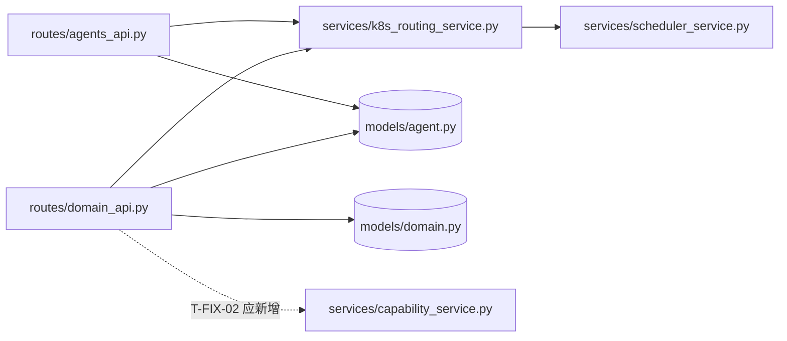

# REVIEW: capability-groups — 能力分组（Capability Groups）

- **Change ID**: capability-groups
- **审查时间**: 2026-09-23 09:08 CST
- **审查者**: AI（Reviewer 角色）· 4.2 二审已派出但本 turn 未回收 → 该节标「待确认」（详见 4.2）
- **总体结论**: **阻塞（不通过）** —— 2.0 金字塔门禁 🔴（`TEST.md` 与 CHANGE.md 自declared 的 `test_backend.py` 均不存在）+ 5 项 🔴 Critical。按 kit-6-review 步骤 2.0：**先回 5-test 补完**，Critical 未修或未获「已知接受」签字前禁止进 7-integration（R2.5）。

### 审查基线（工件与 diff 的实际情况，R6.2 明示）

| 项 | 状态 |
|---|---|
| `REQUIREMENT.md` | ✅ 在（54 行，FR1-FR5 / NFR1-NFR3） |
| `DESIGN.md` | ✅ 在（105 行，含「健康状态定义」节）—— 按 R2.7 已一并读 |
| `TASK.md` | ✅ 在（53 行 / **7 个 task 全为 `状态: [ ]` 未勾**） |
| `TEST.md` | ❌ **不存在**（CHANGE.md 变更范围第 5 行明确列为交付物） |
| `.specs/capability-groups/test_backend.py` | ❌ **不存在**（同上，CHANGE.md 列为交付物）；目录内只有 `_quick_test.py`（打印式脚本，无断言、需活服务端） |
| `UI-DESIGN.md` | ❌ 不存在（本 change 改了 `.tsx`，属前端项目 → 第三轮触发但无 UI 基线可比） |
| 「本次 diff」 | ⚠️ **无独立 diff 可取**。仓库以 `16117315 first commit` 整体导入，`d5a70feb` 仅为目录扁平化重命名（backend 全量 0→N 行）。故本轮以 **CHANGE.md「变更范围」表列出的 4 个文件面**为审查面，逐面核对代码事实。**此替代口径需人工确认（R18.1 ④）** |

> R2.7 全仓预检（同批扫描，供 STATE 使用）：本仓库当前**没有任何 change 具备进入 6-review 的完整前置**：
> `capability-groups`（缺 TEST.md）、`agent-domains`（缺 TEST.md、缺 REVIEW.md，代码已上线）、`small-model-decisions`（缺 DESIGN/TASK/TEST，无代码）、`knowledge-plus`（仅 TEST.md）、`multi-provider`（仅测试脚本）、`agent-control-plane`（已审并 4/4 通过，`.specs/agent-control-plane/REVIEW.md`）。选 `capability-groups` 作为本 issue 的审查目标：它是**工件最全且代码已实现**的一个。

---

## 第一轮 · Spec 合规审查

| 检查项 | 结果 | 证据 |
|---|---|---|
| FR1 Agent 按 capability 过滤 | ❌ **未忠实实现** | `backend/routes/agents_api.py:25,36-38` 用 `Agent.model_config_json.contains(f'"{capability}"')` → 编译为对整个 JSON 文本的 `LIKE '%…%'`。实测（SQLite 内存库，见「复现」）语义错误 |
| FR1 可与 `domain_id` 组合 | ✅ | 同函数 `:29-35`，`domain_id=0` → `IS NULL`（默认域）分支正确 |
| FR2 域内能力列表端点 | 🟡 实现，但**零消费者** | `backend/routes/domain_api.py:100-119` 存在且形状符合契约（额外多 `domain_name`，additive）；`frontend/src/stores/domains.ts` 全文无该端点的 fetch —— 前端在 `AgentControlPlane.tsx:585-605` 本地派生分组。用户故事 4「以便外部集成」因此**不可验证** |
| FR3 三层域树 | ✅ | `AgentControlPlane.tsx:585-605`（派生）+ `:660-698`（渲染 `CapabilityGroupRow`）+ `:708`（`expandedGroups: Set<string>`，key 格式符合 DESIGN §「展开状态」） |
| FR4 能力组展示（名称/数量/健康概要/箭头） | ✅ 实现符合 DESIGN | `:397`（`isAgentHealthy`）+ `:427-438`（📦 名、`{healthyCount} healthy / {totalCount} total`、`ChevronRight` 旋转箭头）。口径与 DESIGN.md:97-104「running/standby → healthy」**逐条一致** |
| FR5 未分类 / 默认域 | ✅ | `:594-596`（无 capabilities → `未分类`）、`:860-870`（默认域行，`isDefault`） |
| NFR1 零新增 TS 错误 | 🟡 不可完整验证 | 实跑 `tsc --noEmit -p tsconfig.json` → **32 个错误**，全部落在 `ProjectDetail.tsx`(15)、`__tests__/*`(12)、`ToolMarket.tsx`(2)、`WorkflowCreate.tsx`(1)、`ProjectManager.tsx`(1)、`AgentBuilder.tsx`(1)；`AgentControlPlane.tsx` 与 `stores/` **0 错误**。但项目构建契约本身是红的（pre-existing，见 STATE.md），无基线可 diff，「零**新增**」无法证明 |
| NFR2 向后兼容（现有端点/UI 不受影响） | ❌ **无证据** | 无 `TEST.md`、无 `test_backend.py`、`backend/tests/` 7 个文件**无一** grep 到 `capability`（实测）。回归完全未覆盖 |
| NFR3 虚拟分组 · 不建新表 | ✅ | `backend/models/` 无新增；`domain_api.py:110` 只读 `Agent` |
| 未引入 out-of-scope 内容 | ⚠️ 判不了 | `REQUIREMENT.md` **无 out-of-scope 段**（需求侧缺口，非实现问题）→ 记为 R18.4 议题 |
| 未范围蔓延 | 🟡 | `CapabilityGroupRow` 额外承担**自动路由 / 扩容 / 排队 badge**（`:445-490` props `onRoute`/`onScale`/`queueCount`/`autoRouteEnabled`），FR4 只要求「组名、数量、健康概要、箭头」。该能力属 control-plane / k8s 面，与另一 change 的职责重叠（R7 边界疑点）→ 待人工裁定归属 |
| 未越过 DESIGN 边界 | ❌ | DESIGN.md:54-66 明写后端实现应为「**`JSON_CONTAINS` 或 Python 端过滤**」，两种都**没用**，改用第三种（JSON 文本 LIKE）→ 设计偏离，且是唯一导致 FR1 错误的决定 |

**FR1 复现记录**（只读实验，未写盘；`cd backend && /home/malizhi/.venv/bin/python -c`，SQLAlchemy 2.0.54 + 内存 SQLite，3 条 Agent）：

```
编译出的谓词 : agents.model_config_json LIKE '%' || '"code-review"' || '%'
MySQL 方言   : agents.model_config_json LIKE concat('%%', '"code-review"', '%%')   ← JSON 列直接 LIKE，本项目 MySQL 为可选部署（CLAUDE.md），未实测 → 待确认

capability=code-review -> ['A','B']   期望 ['A']    ← B 的 capabilities 为空，"code-review" 出现在无关 key(note) 的值上 = 假阳性
capability=code_review -> ['A','B']   期望 []       ← 用户输入的 `_` 未被转义，成 SQL 单字符通配符
capability=%           -> ['A','B','C'] 期望 []     ← 通配符透传，过滤器可被完全绕过（返回含无能力 Agent）
```

> 说明：`contains()` 走的是**绑定参数**，`LIKE` 模式未转义只造成**语义绕过**而非 SQL 注入（`autoescape` 默认 False）。此点已核实，勿升级成注入告警。

**Spec 合规结论**：**不通过**。FR1 语义错误 + NFR2 零证据 + 偏离 DESIGN 指定实现方式。

---

## 第二轮 · 代码质量审查（6 维衰退风险）

### 2.0 TEST.md 5 轮金字塔完整性 —— 🔴 Critical（门禁）

| 轮次 | 状态 | 缺漏 |
|---|---|---|
| 1 功能 | ❌ | `TEST.md` 不存在；FR1-FR5 无一条有自动化测试；`backend/tests/` 0 命中 `capability`；`_quick_test.py` 为 print 脚本（无断言、依赖活服务、非常规测试入口，不进 pytest 收集） |
| 2 性能 | ❌ | 文件缺失，状态未声明（跳过的轮次也必须给理由，R5.4） |
| 3 安全 | ❌ | 同上 |
| 4 兼容 | ❌ | 同上（MySQL 可选部署的 JSON/LIKE 兼容性正是本轮该管的事，见 R2 发现） |
| 5 可观测 | ❌ | 同上 |

按 kit-6-review 步骤 2.0：**任意一项不达 → 🔴 Critical，先回 5-test 补完再继续后续审查**。本轮后续 2.1 的发现**照常报告**（已实测取证，压着不报等于丢信息），但**门禁结论不因它们而放松**：本 change 现在是「红」。

### 2.1 6 维诊断 · 严重度统计

| 编号 | 衰退风险 | 🔴 | 🟡 | 🟢 |
|---|---|---|---|---|
| R1 | Cognitive Overload 认知过载 | 0 | 1 | 0 |
| R2 | Change Propagation 变更传播 | 1 | 1 | 0 |
| R3 | Knowledge Duplication 知识重复 | 1 | 1 | 0 |
| R4 | Accidental Complexity 偶然复杂 | 0 | 1 | 0 |
| R5 | Dependency Disorder 依赖混乱 | 0 | 1 | 0 |
| R6 | Domain Model Distortion 领域扭曲 | 1 | 0 | 0 |
| —（UI · 第三轮另计） | | 3 | 1 | 1 |

### 2.2 6 维诊断 · 详细发现（4 要素）

### 🔴 R3 · Knowledge Duplication：新端点重写了同文件已 import 的既有 helper

**Symptom**：`backend/routes/domain_api.py:110-118` 手写「取 `model_config_json.capabilities` → 判 list → 过滤非 str/空白 → 去重」。同一逻辑的**规范实现**在 `backend/services/k8s_routing_service.py:20-29` `_extract_capabilities()`，而 `domain_api.py:9` **已经 import 了它**，并在 `:175` 与 `:211` 正常使用。同一决定在 5 处各表达一次：`k8s_routing_service.py:20`（规范）、`domain_api.py:110-118`（本次新增副本）、`agents_api.py:37`（本次新增，且**语义不同**）、`agent_knowledge_api.py:714`、前端 `AgentControlPlane.tsx:590` / `AgentBuilder.tsx:48`。
**Source**：Hunt & Thomas · *The Pragmatic Programmer* ·「Don't Repeat Yourself」；Fowler · *Refactoring* ·「Duplicated Code / Divergent Change」。项目侧对应 R6.4「沿用既有抽象」+ `CLAUDE.md` 约定「数据库访问统一走 …」。
**Consequence**：capability 的口径变更（例如将来允许 `{name, weight}` 对象形式，或加命名空间）需要同时改 5 处；漏一处即「路由认为有、UI 不显示、API 过滤不出来」三类静默不一致。已有一处（`agents_api.py:37`）**现在就**与其他不一致。
**Remedy**：
```python
# before (domain_api.py:110-118)
agents = db.query(Agent).filter(Agent.domain_id == domain_id).all()
caps_set = set()
for a in agents:
    cfg = a.model_config_json or {}
    caps = cfg.get("capabilities", [])
    if isinstance(caps, list):
        for c in caps:
            if isinstance(c, str) and c.strip():
                caps_set.add(c)

# after —— 复用本文件已 import 的规范 helper
agents = _owned_agents(db, user, domain_id)          # 见 T-FIX-04
caps_set = {c for a in agents for c in _extract_capabilities(a)}
```
并把 `_extract_capabilities` 提为 `services/` 公开函数（去下划线），前端对应逻辑收敛到 `stores/domains.ts` 一个 selector。
**生成 fix 任务**：T-FIX-02

### 🔴 R6 · Domain Model Distortion：「Agent 拥有某 capability」存在两套互相矛盾的真相

**Symptom**：API 层把 capability 当成「JSON 文本里出现了 `"x"` 这个带引号的子串」（`agents_api.py:36-38`）；UI 与路由层把它当成「`model_config_json.capabilities` 数组的成员」（`AgentControlPlane.tsx:585-605`、`k8s_routing_service.py:20-29`）。上表复现即为反例：Agent B 无 `code-review` 能力，**API 会返回它、画布不会分组它**。
**Source**：Evans · *Domain-Driven Design* ·「Ubiquitous Language / 模型与实现一致」；Fowler · *Refactoring* ·「Speculative Generality 的反面：模型失真」。
**Consequence**：外部集成方（用户故事 4 的目标读者）拿到的 Agent 集合与平台自己在画布上展示的集合不同 → 按 API 结果做扩缩容/路由决策会作用于错误的 Agent 组。这类 bug 在测试数据里通常不显形（需要恰好「别的 key 上出现同名值」），线上才炸。
**Remedy**：单一真相 = 数组成员判定。Python 端过滤（DESIGN.md:54-66 给的两个合法方案之一）：
```python
if capability:
    agents = _filter_owner(db.query(Agent), user).all()
    agents = [a for a in agents if capability in _extract_capabilities(a)]
```
数据量大再上 MySQL `JSON_CONTAINS` / SQLite `json_each`，并把「按哪个方言」写进 DESIGN 的兼容性约束里（R6.2：MySQL 路径本轮未实测，属待确认）。
**生成 fix 任务**：T-FIX-01

### 🔴 R2 · Change Propagation：本次新增第 7 处「域内全量 Agent」越权读，且 `visibility` 全局未生效

**Symptom**：`domain_api.py:110` `db.query(Agent).filter(Agent.domain_id == domain_id).all()` **无 owner / 无 visibility 过滤** —— 这是该文件第 **7** 处同形查询（实测 `:34, 91, 110, 143, 172, 208, 279`，本次新增 `:110`）。入口只做了 `_filter_owner(Domain)`（`:105-108`），因此**任何域 owner 都能读出域内他人 Agent 的 capability 集合**。而 `models/agent.py:33` `visibility` 默认 `"private"` 在**整个 backend 从未被用于任何查询条件**（全仓 grep：仅 `to_dict()` 输出 + `domain_api.py:248` 模板复制）。
**Source**：Fowler · *Refactoring* ·「Divergent Change / 同一不变量散落在多处」；Martin · *Clean Architecture* · 边界处强制策略。项目侧对应 `CLAUDE.md`：「同一不变量应在两处独立校验（入口 + 中间件），不要假设前一处覆盖了所有入口」。
**Consequence**：泄露面随域数线性增长（每新增一个端点就复制一次这条查询）。capability 列表虽非密钥，但足以刻画他人 Agent 的能力画像 + 证明其存在，与 `visibility=private` 的产品承诺直接冲突。
**Remedy**：把「域内可见 Agent」收成**一个**函数 `_visible_agents(db, user, domain_id)`（admin 全量 / 非 admin 取 `owner_id == user["id"] or visibility != 'private'`），7 处调用点全部替换；`visibility` 要么落实执行要么从模型删除并改文档。**这是跨端点的统一修复，宜开新 CHANGE**（本 change 只承担 `:110` 一处 + 登记议题）。
**生成 fix 任务**：T-FIX-04（本 change 面内）+ 全量替换登记为议题（R18.4）

### 🟡 R4 · Accidental Complexity：用字符串模式匹配冒充集合语义

**Symptom**：`agents_api.py:36-38` 三行里塞了「序列化 JSON → 手工补双引号 → LIKE → 通配符不转义」四层偶然复杂度；替代方案（`_extract_capabilities` + `in`）是**一行**且已在同仓存在。
**Source**·Bachman ·*Structure of Programming*／Ousterhout ·*A Philosophy of Software Design* ·「复杂度是功能乘出来的」；Ousterhout ·「Define Existence Out of Arguments」。
**Consequence**：后续维护者会加 `escape`、加 CAST、加分支兼容 MySQL —— 每一步都在给一个本不该存在的抽象打补丁。
**Remedy**：见 T-FIX-01；同时删除手写引号拼接。
**生成 fix 任务**：T-FIX-01

### 🟡 R1 · Cognitive Overload：单文件 1428 行 / 单组件 176 行 / 14 个 props

**Symptom**：`frontend/src/pages/AgentControlPlane.tsx` = **1428 行**、一个文件内 ≥10 个组件；本次新增的 `CapabilityGroupRow`（`:370-540`）约 **171 行**、props **14 个**（`:371-386`），其中 `routeLoading`/`scaleLoading`/`autoRouteEnabled`/`queueCount` 与「能力分组」这一职责无关（同一组件既分组又承担路由/扩容操作面）。
**Source**：Martin · *Clean Architecture* ·「SRP 于模块」；Hunt & Thomas ·「Orthogonality」；Ousterhout ·「Class Tendency / 认知负载」。
**Consequence**：改分组展示要连带读懂排队/限流/loading 状态；本 change 的 UI 缺陷（见第三轮无障碍项）会扩散到不相关的控制面逻辑。
**Remedy**：把 `CapabilityGroupRow` 拆为 `CapabilityGroupHeader`（分组+健康概要）与 `GroupOpsBar`（路由/扩容/排队，props 打包成一个 `ops` 对象或下沉到 store 的选择器）；文件按组件切目录。
**生成 fix 任务**：T-FIX-05

### 🟡 R3（附）· Knowledge Duplication：同一文件内三种「健康」口径，其中一种永假

**Symptom**：`AgentControlPlane.tsx:366-367` `isAgentHealthy = status in {running, standby}`（与 DESIGN.md:97-104 一致，✅ 本 change 采用之）；`:74` 用 `probe.health === 'healthy'`（探针口径，另一个概念）；`:156-157` 与 `:1137` 判断 `agent.status === 'healthy'` —— **`healthy` 从不是 Agent.status 的取值**（实测写入点：`agents_api.py:125 'running'`、`:167 'standby'`、`reconcile_loop.py:419 'paused'`、`:439 'degraded'`，无任何处写 `'healthy'`）→ 该分支恒假，Agent 行状态徽标**永远走红色底**。
**Source**：Evans · *DDD* ·「统一语言」；Fowler ·*Refactoring* ·「Dead Code / Speculative Branch」。
**Consequence**：`:156/:1137` 属 pre-existing（非本 change 引入），但本 change 的 DESIGN 首次把健康口径**写成规范**，于是这两行成为可判定的错码：用户在域树里看到所有 Agent 都像异常。
**Remedy**：抽 `lib/agentHealth.ts`（`isAgentHealthy` + `probeHealthOf`）供三处共用；`:156/:1137` 改为 `isAgentHealthy(agent.status)`。
**生成 fix 任务**：T-FIX-03（其中 `:156/:1137` 归属 pre-existing，建议并入同一任务，不另开 change）

### 🟡 R5 · Dependency Disorder：业务逻辑落在 routes 层

**Symptom**：`domain_api.py:101-119`（集合派生 + 去重 + 排序）与 `agents_api.py:25-39`（过滤策略）写在路由里；`CLAUDE.md` 约定「路由只做参数校验与鉴权，业务逻辑放 `services/`」。方向上未出现反向/循环（见 2.3），属**层级渗漏**而非依赖混乱。
**Source**：Martin · *Clean Architecture* ·「Dependencies point inward」；项目自订约定（`CLAUDE.md` §约定）。
**Consequence**：capability 逻辑无法被非 HTTP 入口（定时任务、CLI、引擎）复用 —— 而 `scheduled_task` 已经有一条 `capability` 列（`agents_api.py:222-232`），下一步就会再抄第三份。
**Remedy**：新建 `services/capability_service.py`（`capabilities_of(agent)` / `filter_by_capability(agents, cap)` / `distinct_capabilities(agents)`），routes 只做校验与鉴权。与 T-FIX-02 合并执行。
**生成 fix 任务**：T-FIX-02

### 2.3 架构依赖图

2.2 触发条件逐项判：新增顶级模块/package ❌ · 危险 import 合并 ❌ · 新中间件/服务 ❌ · 跨 ≥5 模块重构 ❌ → **未触发**，只给本次面的最小方向核对（grep 实测）：



**循环依赖**：无（`grep "^from routes|from main import"` 在非 routes 层 0 命中；`main.py` 为组装根）。
**反向依赖**：无（routes→services→models 单向）。**唯一反向风险 = 业务逻辑住在 routes 层**（R5 发现），已出 fix。

---

## 第三轮 · UI 视觉审查（触发：本 change 改 `AgentControlPlane.tsx`）

> ⚠️ 覆盖盲区先说清：**无 `UI-DESIGN.md`** → 3.3「视觉北极星一致性」无法判定（不是"通过"，是"没基线"）。3.1 的颜色/token 判定按 `frontend/src/styles/tokens.css` 实际存在的变量执行。

### 3.1 Design Tokens 一致性

| 检查项 | 结果 | 证据（行号在本 change 组件内优先） |
|---|---|---|
| 颜色全部来自 token | ❌ | **硬编码纯白 `#fff`**：`:457`、`:473`（均在 `CapabilityGroupRow` 的操作按钮上）；另 `:850, :962, :1012, :1225`（pre-existing 同形）。`tokens.css` 无中性白/前景 token |
| 无硬编码 hex | ❌ | 同上（`#fff` ×6） |
| 无硬编码字号 | ❌ 命中即 🔴（kit 3.1 规则原文） | `:427` `fontSize: 10`、`:433` `fontSize: 10`、`:437` 同、`:405/:409` `fontSize: 10/11`、`:459/:475` `fontSize: 10` 等 —— 根因：**`tokens.css` 只有 `--font`（族）与 `--font-mono`，没有字号 scale token**，所以「用 token」在物理上不可用 |
| 无硬编码间距 | ❌ 同上 | `padding: '6px 8px'`(`:401,404`)、`'8px 12px'`(`:415`)、`'2px 8px'`、`'1px 6px'`(`:433,436`)、`borderRadius: 4/8`（`:402,441` vs `--r-sm` 存在却未用） |
| 字体与 UI-DESIGN 一致 / 无 anti-pattern 字体 | ⚠️ 无法判（无 UI-DESIGN）+ **pre-existing 命中**：`tokens.css:43` `--font: -apple-system, BlinkMacSystemFont, 'Segoe UI', Roboto, sans-serif` 含 **Roboto**（强制禁忌 · 字体类）。非本 change 引入 | → 议题（R18.4），不入本 change |
| 第二个强调色 / 彩底灰字 / 纯黑纯白 | ❌ 纯白已记；`var(--purple)` 用于能力标签底色（`AgentBuilder.tsx:98`）属语义色，按「判断模糊地带」不判违规 | |

### 3.2 Anti-Pattern 扫描（逐条对照 `reference-ui-anti-patterns.md` 强制禁忌）

| 类别 | 命中 | 位置与说明 |
|---|---|---|
| 布局类 · **卡片嵌套卡片** | 🔴 **命中** | `AgentControlPlane.tsx:585-605` 的域容器是卡片（`border 1px + borderRadius: 8 + background: var(--bg-card)`），其展开区 `:660-698` 内每个 `CapabilityGroupRow` 又是一张卡片（`:402-403` `border + borderRadius: 4`），组内 Agent 行再套表格 → **三层树=三层卡片**，正是清单里「hierarchy flatten 优先」点名的形态 |
| 布局类 · 统一 4/8/12/16/20 间距 | 🔴 命中 | 同上间距值（4/6/8/12/16 族），与清单「用非线性 scale 替代」冲突 |
| 颜色类 · 纯白 `#fff` | 🔴 命中 | `:457, :473`（本 change）+ 4 处 pre-existing |
| 阴影类 | ✅ 未命中 | 本 change 面无 `box-shadow` |
| 边框类（彩色侧条 >1px / 玻璃拟态） | ✅ 未命中 | 仅 1px `var(--border)` |
| 动效类 | ✅ 未命中 | `transition: background .15s` / `transform: rotate` 只动 transform/背景，无 bounce；未动 layout 属性。（`prefers-reduced-motion` 见 3.4） |
| 文案类 | ✅ 未命中 | 无 hedging / lorem；按钮文案为具体动词「自动路由 / 扩容」 |
| 组件类（placeholder 当 label / 模态 ESC） | ➖ 本 change 面无表单与模态 | |

### 3.3 视觉北极星一致性

**未做** —— 缺 `UI-DESIGN.md`，无美学北极星可比。记为覆盖盲区，不记「通过」。

### 3.4 无障碍快检

| 检查项 | 结果 | 证据 |
|---|---|---|
| 交互元素键盘可达 | ❌ | 能力组头是 `<div onClick={onToggle}>`（`:411-413`），非 `<button>`、无 `tabIndex` → Tab 不可达（WCAG 2.1.1 A 硬失败）。域级 `:552-556` 同形（pre-existing 模式），本 change 复制了它 |
| `aria-expanded` / 语义 | ❌ | 展开态只体现在 `transform: rotate(90deg)`（`:425`），读屏无 `aria-expanded`、无 `aria-controls` |
| 焦点环可见 | ⚠️ | 因不可聚焦，焦点环无从谈起；`tokens.css` 是否有 `:focus-visible` 样式未逐一验（**待确认**） |
| `prefers-reduced-motion` | ⚠️ 待确认 | 本 change 的 `transition` 有 `--fast`/`--ease` token 支撑；全局是否包了 reduced-motion 媒体查询未实测 |
| 对比度实测 | ❌ 未测 | 无浏览器/量具在本环境，`#fff` on `var(--blue)` 与 `fontSize: 10` 的 AA 达标**不可凭目测声明** → T-FIX-06 用工具实测 |
| 装饰图标 alt / aria-hidden | 🟢 | 图标为 lucide 组件 + emoji `📦`（`:430`）；emoji 兼作可见标签、又与图标库混用 → 视觉一致性小问题 |

**UI 轮结论**：🔴 ×3（纯白 `#fff`、硬编码字号/间距（根因是 token scale 缺失）、卡片嵌套）+ 🟡 ×1（键盘可达/ARIA）。全部生成 fix 任务。

---

## 第四轮 · 补充审查

### 4.1 技术债评估

**未触发**：本 change 非里程碑/季度大版本/重构项目；`.specs/CONTEXT.md` **无「技术债」段**（实测 grep 0 命中），不满足「多于 30 天未更新」的判定前提。
顺带登记事实（R18.4 议题，不入本 change）：`CONTEXT.md` 头部自述生成于 **2026-07-06**，至今 **79 天**，其 §3 代码规模表已与现实偏离（例：它记「后端 .py 112 / 前端 ts·tsx 96」，当前实测 **117 / 100**）。

### 4.2 跨模型 spot-check —— **触发已判定；二审结果本 turn 未回收 → 待确认**

触发依据（命中 2 条，均已实测）：① 本面涉及鉴权/越权（`domain_api.py:110` 无 owner 过滤，且 `visibility` 全后端未执行）；② `CapabilityGroupRow` ≈171 行 > 80 行。

**已做**：派出一个 **fresh-context 同模型二审 agent**（独立上下文、不带本报告任何结论，只给文件面与 spec 路径，允许其自行做只读复现实验）。

**未做，也不假装**：该二审在本 turn 结束前未返回，其结果**不写进本报告**。故本节结论只有一条：

| 主审发现 | 二审发现 | 是否一致 | 处理 |
|---|---|---|---|
| F1-F15 | — | **待确认**（二审未回收） | G4 汇总轮补记，或按人工裁定改派真跨模型；G4 投票人须把本节当**已知盲区**看待 |

两条诚实边界（R6.2）：

1. **口径**：即便回收，本环境只有同模型可用 —— 那是「fresh-context 二审」，**不等同于** kit 4.2 要的跨模型。是否必须真跨模型 → 见「待人工裁定」第 4 条。
2. **本报告的可信度不依赖本节**。全部实质结论均由主审**自己实跑取证**：FR1 三个反例（内存 SQLite 复现）、谓词编译（SQLite + MySQL 方言）、`tsc --noEmit`（32 错误 / 本面 0 错误）、既有 helper 与 7 处引用点 grep、`visibility` 全后端 grep。二审是**加保险**，不是证据来源；它缺席不改变任何 🔴 判定，也不改变 2.0 门禁的红。

**待办**：G4 汇总轮（收齐 4 票后）补记本节；未补记前本 change 的 4.2 视为未闭环。

---

## 严重发现汇总

| # | 严重度 | 类别 | 描述 | 位置 | fix 任务 |
|---|---|---|---|---|---|
| F1 | 🔴 Critical | 测试门禁 | `TEST.md` 与 CHANGE.md 自declared 的 `test_backend.py` 均不存在，5 轮金字塔全部未声明；FR1-FR5 零自动化覆盖 | `.specs/capability-groups/` | T-FIX-00 |
| F2 | 🔴 Critical | Spec 合规 / R6 | 「Agent 有 capability」两套矛盾真相：API 用 JSON 文本 LIKE，UI/路由用数组成员；跨 key 假阳性 + `%`/`_` 通配符透传（实测复现） | `backend/routes/agents_api.py:25,36-38` | T-FIX-01 |
| F3 | 🔴 Critical | R3 | 重写同文件已 import 的既有 helper（5 处重复表达同一决定） | `backend/routes/domain_api.py:110-118` vs `services/k8s_routing_service.py:20-29` | T-FIX-02 |
| F4 | 🔴 Critical | 安全 / R2 | 新增第 7 处无 owner/visibility 过滤的域内 Agent 查询；`visibility="private"` 全后端从未被执行 | `backend/routes/domain_api.py:110`（同形 `:34,91,143,172,208,279`） | T-FIX-04 |
| F5 | 🔴 Critical | UI 3.1/3.2 | 纯白 `#fff` 硬编码（本 change 按钮 2 处） | `AgentControlPlane.tsx:457,473`（另 `:850,962,1012,1225` pre-existing） | T-FIX-07 |
| F6 | 🔴 Critical | UI 3.1 | 硬编码字号/间距/圆角（根因：`tokens.css` 无字号与间距 scale token，仅 `--s1`/`--r-sm`） | `AgentControlPlane.tsx:401-441,459,475` | T-FIX-08 |
| F7 | 🔴 Critical | UI 3.2 | 卡片嵌套卡片（域卡片 > 能力组卡片 > Agent 行，三层树三层卡） | `AgentControlPlane.tsx:585-605` + `:402-403` | T-FIX-09 |
| F8 | 🟡 Major | Spec 合规 | 偏离 DESIGN 指定的实现方式（「`JSON_CONTAINS` 或 Python 端过滤」两者皆未用） | `DESIGN.md:54-66` vs `agents_api.py:36-38` | T-FIX-01 |
| F9 | 🟡 Major | UI 3.4 | 能力组头 `<div onClick>` 键盘不可达、无 `aria-expanded` | `AgentControlPlane.tsx:411-413,425` | T-FIX-06 |
| F10 | 🟡 Major | R3 附 | 三种「健康」口径并存，其中 `status === 'healthy'` 恒假 → Agent 行徽标永远红（pre-existing，被本 change 的 DESIGN 口径否证） | `AgentControlPlane.tsx:74,156-157,366-367,1137` | T-FIX-03 |
| F11 | 🟡 Major | R1 | 1428 行单文件 / `CapabilityGroupRow` 171 行 14 props，分组与路由扩容同组件 | `AgentControlPlane.tsx:370-540` | T-FIX-05 |
| F12 | 🟡 Major | Spec 合规 | FR2 端点零消费者；用户故事 4「以便外部集成」不可验证 | `domain_api.py:100-119`、`stores/domains.ts`（无 fetch） | T-FIX-11 |
| F13 | 🟢 Minor | R5 | 业务逻辑住 routes 层（项目自订约定冲突） | `domain_api.py:101-119`、`agents_api.py:25-39` | T-FIX-02 |
| F14 | 🟢 Minor | 一致性 | 组顺序两端各自 `sort()`，中文 `未分类` 的落位依赖 locale | `domain_api.py:119` / `AgentControlPlane.tsx:666` | T-FIX-10 |
| F15 | 🟢 Minor | 范围 | `CapabilityGroupRow` 承担路由/扩容（超 FR4 声明），疑与 control-plane change 职责重叠 | `AgentControlPlane.tsx:445-490` | 待人工裁定归属 |

### 覆盖面声明（不把「没找到问题」当「没有问题」）

- **看了**：FR1-FR5 / NFR1-NFR3 逐条；`agents_api.py`（1-70 行）、`domain_api.py`（1-150 + 7 处 Agent 查询清单）、`k8s_routing_service.py`（1-60）、`models/agent.py` 全文、`AgentControlPlane.tsx` 的 `:74,156,360-490,552-700,860-870,1137`、`stores/domains.ts`、`tokens.css` token 清单、`backend/tests/` 全目录 grep、`.specs/capability-groups/` 四份工件。
- **实跑了**：`tsc --noEmit`（32 错误，本面 0）、SQLAlchemy 谓词编译（SQLite + MySQL 方言）、内存 SQLite 三条样本的 FR1 反例复现、`visibility` 与既有 helper 的全仓 grep。
- **没看 / 判不了（盲区）**：① 运行时 UAT —— 未启动 uvicorn/vite，任何"界面看起来对不对"都没验；② 对比度未实测（无量具）；③ MySQL 部署路径未实测 → 待确认；④ 无 `UI-DESIGN.md` → 视觉北极星与美学一致性整节跳过（非通过）；⑤ 无 `TEST.md` → 5 轮金字塔只能判缺，不能判过；⑥ 未审 `agent-domains`/`knowledge-plus`/`multi-provider`/`small-model-decisions`（均不满足预检）；⑦ 无独立 diff，按 CHANGE「变更范围」表界定审查面，可能漏掉未列在该表却被顺带改动的文件；⑧ 「未与 pre-existing 代码划清归属」的行已逐条标注，但 79 天未更新的 `CONTEXT.md` 使部分「是不是本次引入」只能靠 grep 推断。

---

## 待人工裁定（R2.5：🔴 必须修复或显式「已知接受」并签字）

| # | 需人拍板的取舍 | 依据 |
|---|---|---|
| 1 | F5/F6/F7 三项 UI 🔴 属**全仓既有风格**（`#fff` 另 4 处、无 token scale 是 `tokens.css` 结构性缺口、三层树是产品形态本身）。选「本 change 内全修」还是「整体视觉规范化另开 change + 本 change 显式已知接受」？ | 规则要求 🔴 不得被 AI 自行降级（R2.5） |
| 2 | 无独立 diff，是否接受以 CHANGE.md「变更范围」表作为审查面口径？ | R2.7 要求「本次 diff」 |
| 3 | `CapabilityGroupRow` 的路由/扩容按钮归属：本 change 剥离，还是承认为 control-plane 面（F15）？ | R7 范围控制 |
| 4 | 4.2 需不需要真·跨模型二审（本环境仅做到 fresh-context 同模型二审）？ | kit 4.2「强烈建议」 |
| 5 | F4 的全量替换涉及 7 个端点 + `visibility` 存废 → 是否开新 CHANGE（我倾向：本 change 只修 `:110`，其余进 ROADMAP 议题）？ | R3.2 / R7.1 |

---

## 修复任务（已追加至 `TASK.md`，编号延续）

见 `.specs/capability-groups/TASK.md` 末尾「## 修复任务（6-review 产出）」段：**T-FIX-00 ~ T-FIX-12**，每条含 `verify` 命令。T-FIX-00（补 5-test）为**回退任务**：完成前本 change 不得重进 6-review。

---

## 自检

- [x] 三轮主审查都做了（一轮 Spec / 二轮 6 维 / 三轮 UI；本 change 涉 `.tsx` 故第三轮不可跳）
- [x] 二轮 6 维输出含 4 要素 + 书本引用 + R1~R6 编号
- [x] 第四轮按触发条件判完：4.1 未触发（已写明判据）· 4.2 触发已判定，**二审结果未回收 → 该节明示「待确认」，未冒充已跑**
- [x] 每条发现都有严重度标签 + `file:line` + 依据
- [x] 每个 Critical 都已生成 fix 任务
- [x] 报告里没有自己悄悄改过的代码（R3.3 全程只读；实验均为 `-c` 内联、未写盘、未入仓库）
- [ ] **🛡️ G4 门禁**：见 issue 回帖（本文件写完后在同一条评论召集 4 位专家投票）

**下一步**：G4 结果出来后 —— 若放行 → 回 `5-test` 执行 T-FIX-00；🔴 全部修复或取得人工「已知接受」签字后，方可重进 6-review → 7-integration。**当前不得进集成。**
